# Sprint 14 screenshots

Captured from the built app against the seeded demo data (headless Chromium). The browser script that produced them is `verify-s14.mjs.txt` (28 checks, all passing): a new customer registers through the UI, adds an address inside checkout, pays by delivery with the sandbox card (decline, insufficient funds, retry, success), sees a price change, cart availability, signs out (server-side) and resets a password; plus mobile checks that each new CTA is above the bottom bar and the pages do not overflow horizontally.

### Address form inside checkout (manual lat/lng/landmark/phones/zone, optional geolocation)
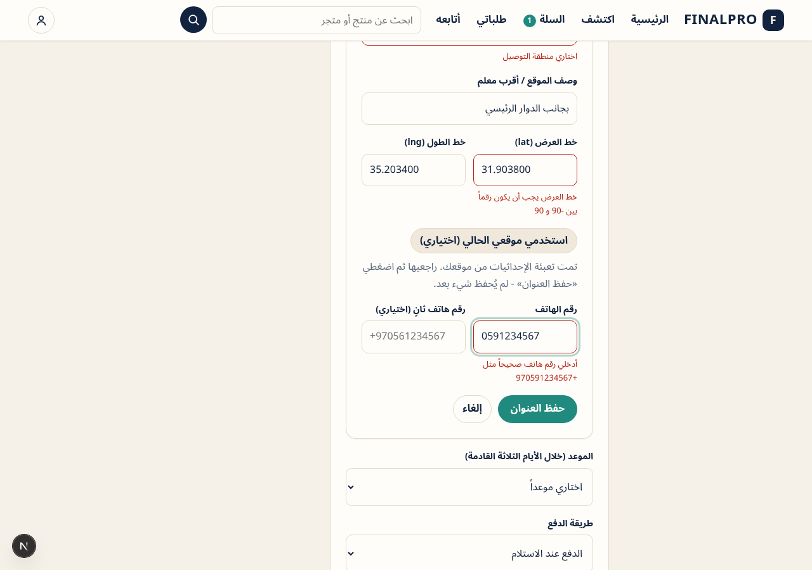

### Sandbox card form
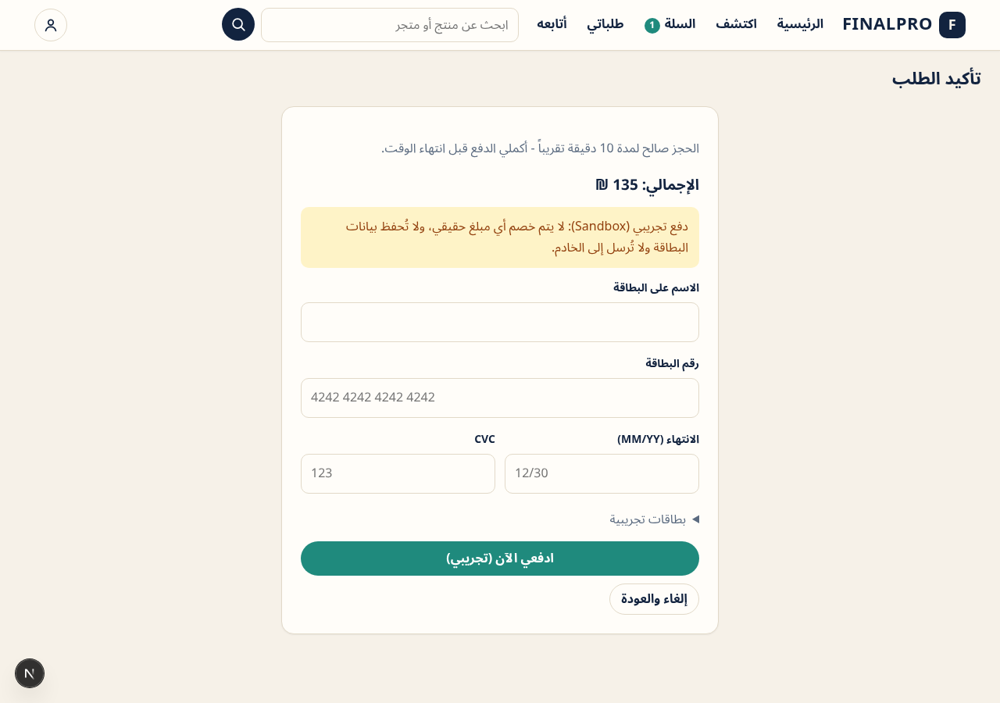

### Declined card: reason shown, reservation kept
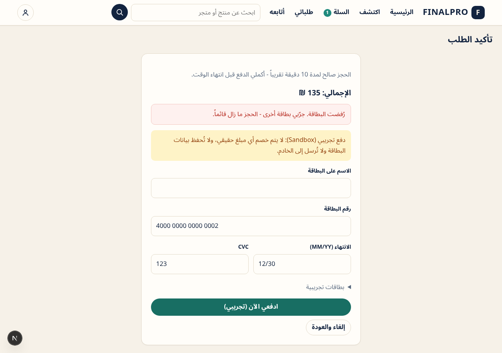

### Retry with a good card creates the delivery order
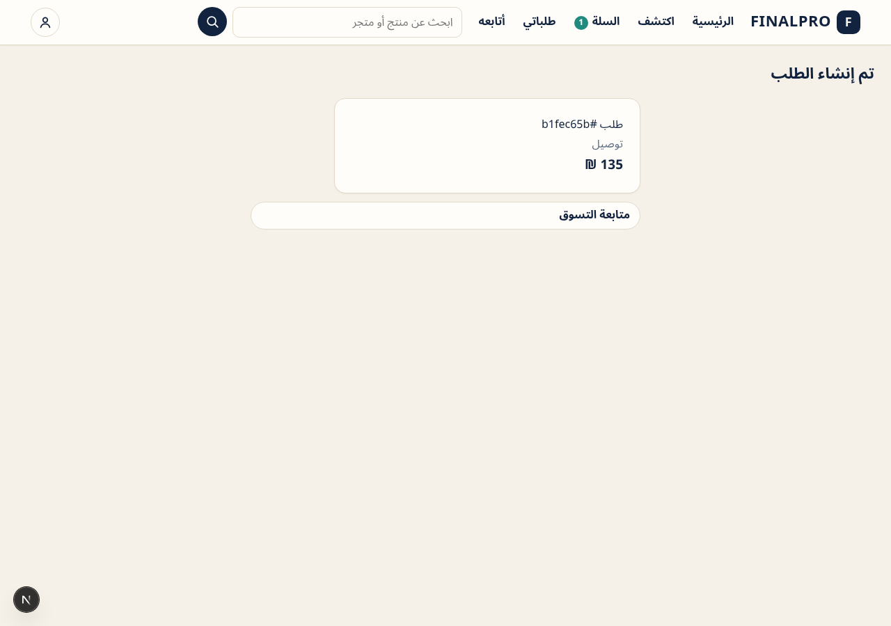

### CHECKOUT_PRICE_CHANGED shown as old -> new with the delta
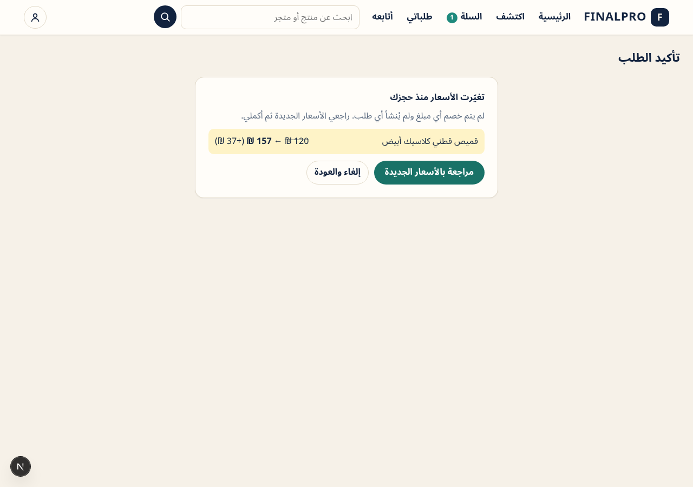

### Cart: sold-out line dimmed, unselectable, removable
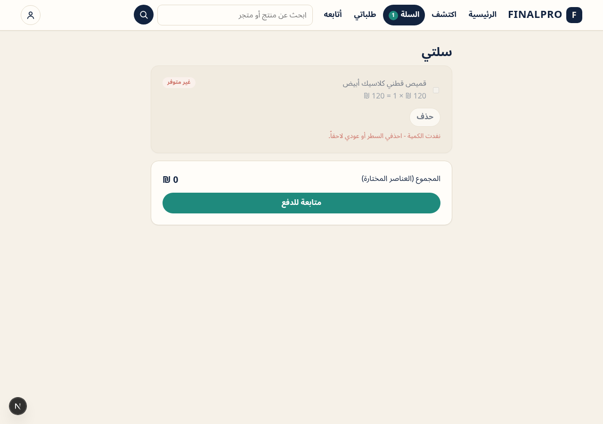

### Cart: quantity above the maximum
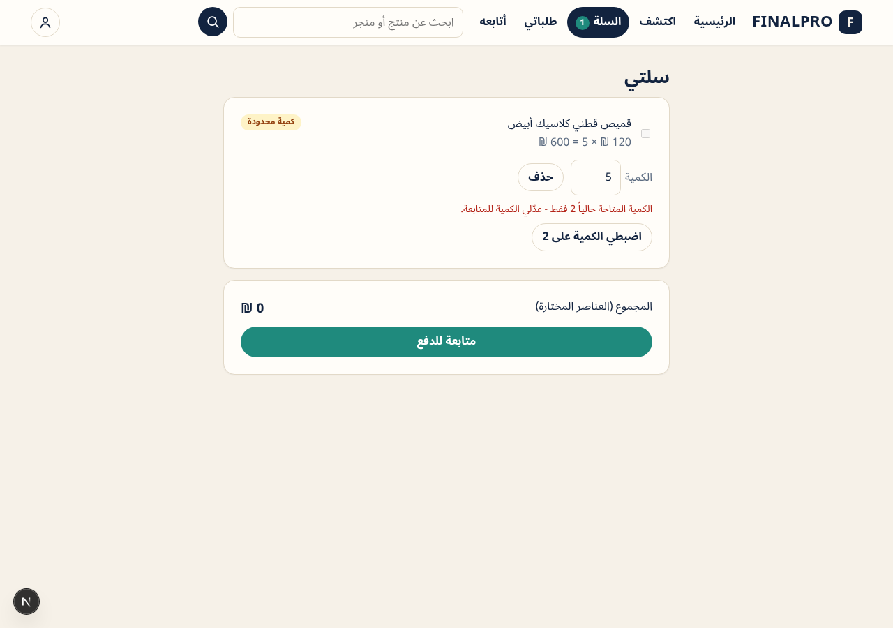

### Address form (mobile)

### Cart (mobile)
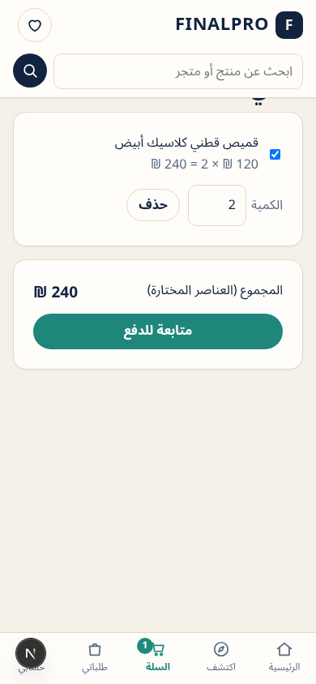

### Card form (mobile), clear of the bottom bar
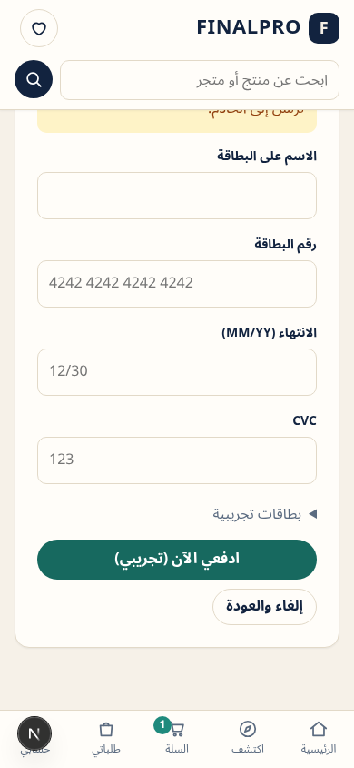

## Review round (Codex)

`verify-fulfil.mjs.txt` (6 checks, all passing): a physical branch defaults to pick-up; an online-only branch with delivery slots defaults to delivery with no pick-up option and reserves without PICKUP_REQUIRES_PHYSICAL_BRANCH; a branch with no valid method shows a clear message and blocks reservation; with 5 + 5 units in two branches the cart maximum is 5 and quantity 6 cannot be selected for checkout; adjusting to the maximum re-selects the line and checkout quotes it.

### No valid fulfilment method
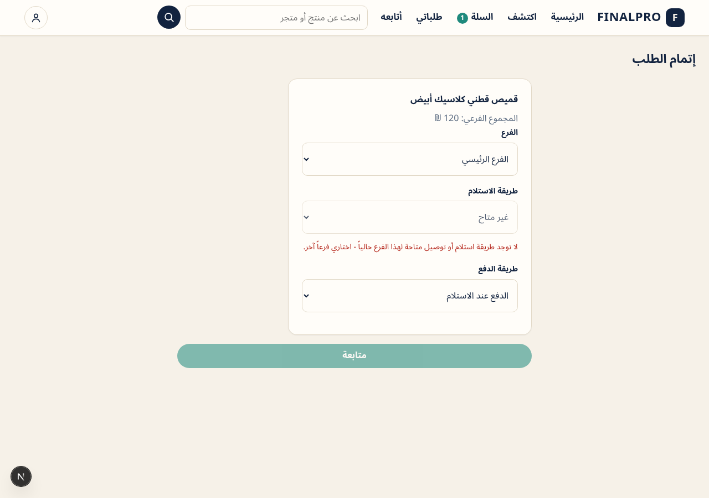

### Two branches, 5 + 5 units: maximum is 5
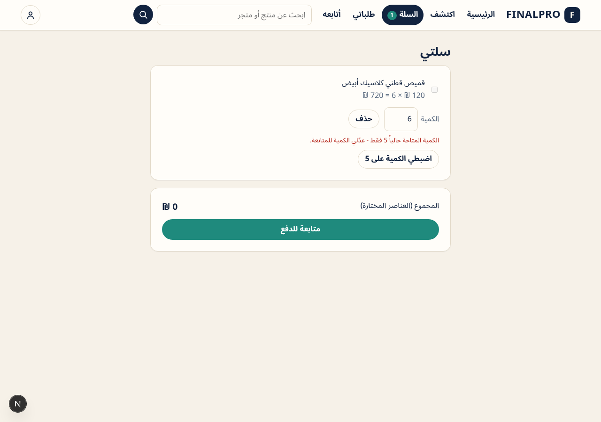
