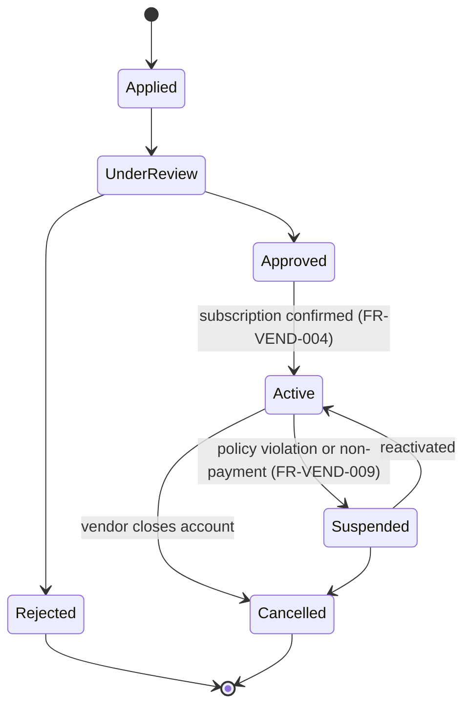
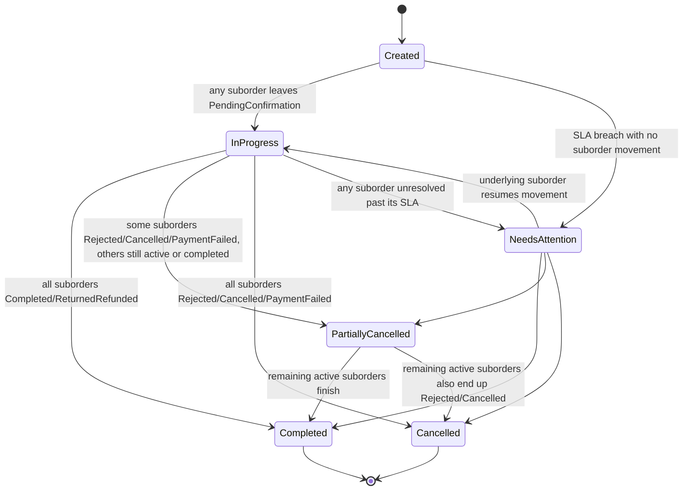
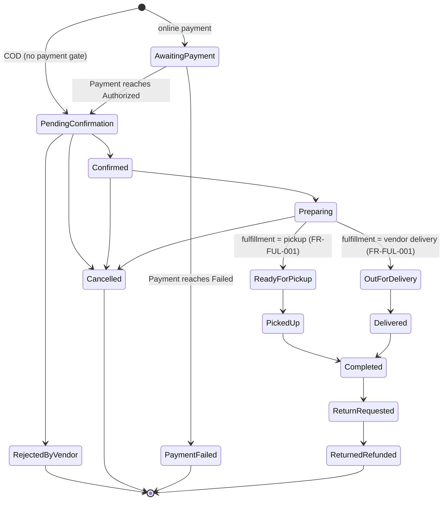
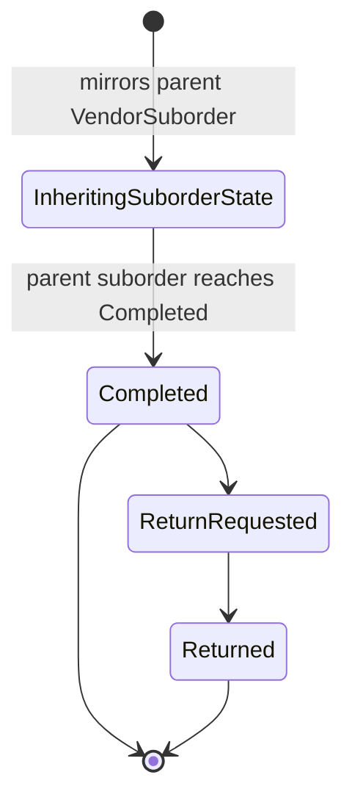
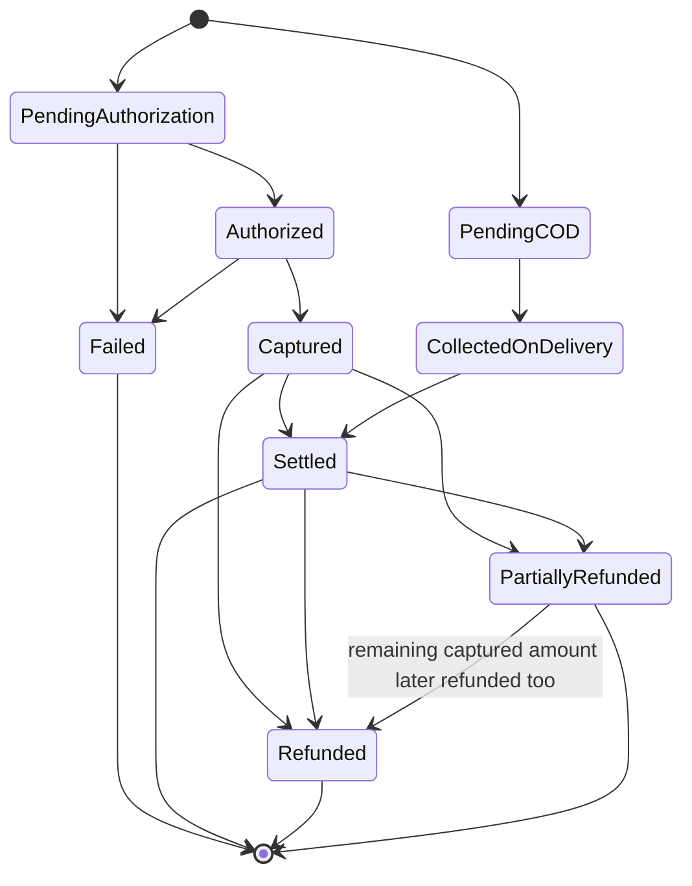
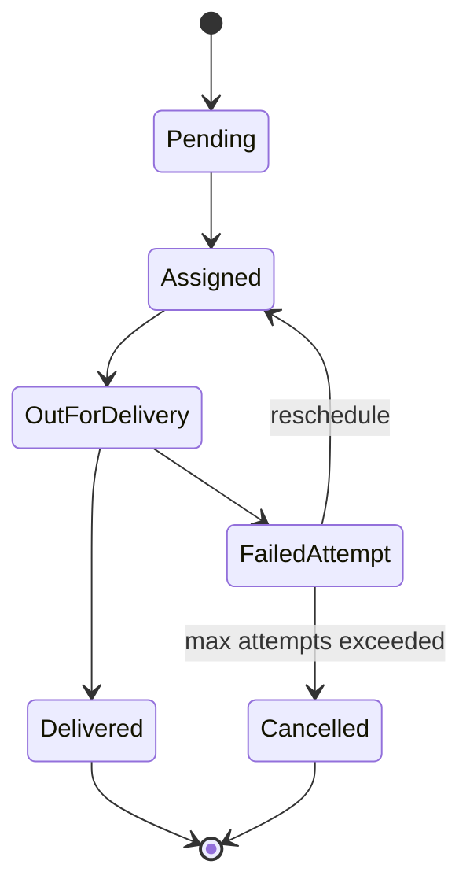
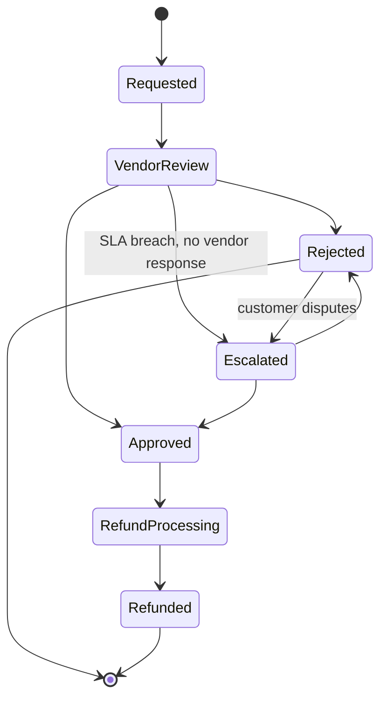

# SRS — Part 2: Functional Requirements (Section E)

Covers Section **E** of the structure required by [`docs/master-prompt.md`](../master-prompt.md), across all 22 modules it names. Builds on [Part 0](00-phase0-scope-and-clarifications.md) (confirmed answers, BR-*, OPEN-001–007) and [Part 1](01-executive-summary-vision-scope.md) (roles, scope, FYP Delivery Increment).

**Language convention:** `must` = mandatory; `should` = strongly recommended, any deviation needs explicit justification; `may` = optional/left to implementation choice.

**Open items convention:** every requirement touched by OPEN-001–007 carries a `⚠ OPEN-00X` tag in its Notes column. These are pending decisions, not settled design — nothing tagged should be built as final until the tagged item is resolved (see Part 0, Section 5). The seven open items, for reference:

| ID | Pending decision |
|---|---|
| OPEN-001 | Licensed, integrable online-payment gateway for the West Bank |
| OPEN-002 | FX-rate source/refresh frequency for cross-currency comparison |
| OPEN-003 | Monthly subscription price tier(s) and grace-period/suspension policy |
| OPEN-004 | SMS/OTP provider for Palestinian phone numbers |
| OPEN-005 | Vendor storefront-verification reviewer assignment and rejection criteria |
| OPEN-006 | Sign-off on the FYP Delivery Increment slice |
| OPEN-007 | Mixed-currency parent-order payment settlement |

---

## E.0 Approved September 2026 requirements amendment

The product owner subsequently approved the [September product-decision baseline](../approved-product-decisions-2026-09.md). The following requirements are binding and supersede conflicting historical rows below. `OPEN-002` and `OPEN-007` are closed by the ILS-only decision; their old tags must not be interpreted as open implementation work. Detailed state-machine, API, data-model, UX, test and backlog revisions follow in Parts 3–9.

| ID | Requirement | Supersedes / notes |
|---|---|---|
| FR-AUTH-013 | The system must permit unauthenticated browse/search/compare only. Creating or retaining a cart, favourites, follows, checkout, reviews and alerts requires a signed-in account. Cart data is server-side and follows the account across devices. | Supersedes FR-AUTH-007 guest-cart merge. |
| FR-AUTH-014 | Account deletion must be a deactivation workflow: block it while an unreceived order exists; revoke sessions; hide nonessential PII; retain necessary order/audit data; and allow OTP reactivation for 30 days. | Refines FR-AUTH-010. |
| FR-VEND-012 | The platform must support physical, online-only and hybrid store operating models. An online-only store has one hidden stock-holding warehouse and zero or more public pickup points; pickup points never own inventory. | Supersedes physical-branch-only onboarding assumption. |
| FR-VEND-013 | Store-owner and branch-employee access must be role grants on the same account that can also use the customer workspace. An employee is assigned to exactly one branch at a time; an owner may own multiple stores. | Supersedes FR-VEND-007’s old staff-role split. |
| FR-VEND-014 | A store must publish at least one external customer contact route—Instagram, Facebook or WhatsApp. Internal chat and stories are out of scope for phase 1. | New. |
| FR-CAT-015 | Before an offer may publish, it must have a title, primary image, general category, regular ILS price, stock and five category-template matching/search fields; `N/A` is allowed where applicable. | The exact five fields per category are ⚠ OPEN-013. |
| FR-CAT-016 | Storefront sections must be one level: fixed All; automatic New arrivals and Discounts; and up to 20 vendor custom sections. Products may belong to multiple custom sections; deleting a section never deletes its offers. | New. |
| FR-MATCH-011 | Every offer must have a store-inventory barcode unique within that store. If no manufacturer barcode is supplied, generate a printable internal label. The shared internal platform-product barcode is distinct, stable, never customer-visible and never overwrites a store barcode. | Supersedes one-code-for-all interpretations. |
| FR-MATCH-012 | Matching must evaluate structured attributes first, text similarity second and image similarity third. A vendor explicitly confirms a proposed match; rejected/ignored results may publish unmatched and support a re-search request. | Refines FR-MATCH-002–004. |
| FR-IMPORT-008 | A CSV/Excel row with the same store barcode and a new colour/size adds that variant/stock. It must enter manual review—not silently update—when brand, base product type, or present MPN/model conflicts. Valid rows import while invalid/review rows report their row-specific reason. | New. |
| FR-SEARCH-013 | Public discovery must provide All, Women, Men, Kids and Accessories pages; stores select one or more applicable types at onboarding and may edit them. Search must cover stores and products with immediate suggestions and Arabic/English tolerance. | New. |
| FR-SEARCH-014 | Store and product view ranking must count no more than one view per account/device per two-hour period. | New. |
| FR-COMP-010 | A global canonical-product card must show the lowest eligible available ILS price and up to five logos of the cheapest eligible stores. Selecting a logo opens that specific store offer; selecting the card opens the cheapest eligible offer, using rating then permitted distance to break a price tie. | Supersedes FX/native price display. |
| FR-COMP-011 | Comparison must list every eligible offer low-to-high in responsive offer cards. A selected colour/size restricts offers to that variant, and cart addition requires navigating into a store’s product detail page. | New. |
| FR-PRICE-008 | Every monetary value in the platform—including product/discount prices, fees, payments, refunds, subscriptions, comparison and analytics—must be stored and presented in ILS. FX tables, conversion and mixed-currency settlement must not be implemented. | Supersedes FR-PRICE-001/007 and OPEN-002/007 dependency. |
| FR-PRICE-009 | An offer may have variant-specific ILS base prices but has one active percentage discount across its physical branches. Only owner access may change prices/discounts; discount is 0–100 exclusive and has start/end dates. | New. |
| FR-INV-008 | Inventory is per branch and offer variant. Public users see Available, Low stock (1–3), or Sold out, never exact counts; checkout validation may disclose the maximum purchasable quantity. No inventory transfer between branches is supported in phase 1. | Refines FR-INV-004. |
| FR-INV-009 | A branch employee physical sale must scan a barcode, select colour/size, enter quantity, atomically decrement stock and audit the movement. It must reject zero/negative stock and records no receipt/payment details. | New. |
| FR-INV-010 | Every manual non-sale stock reduction requires a reason (damage, loss or count correction) and immediately notifies the store owner with employee and branch identity. | New. |
| FR-CART-017 | The cart must require explicit item selection for checkout; unselected lines remain. Checkout groups selected lines by a single eligible stock-holding branch. If no one branch can fulfil all such lines, create separate groups. | Supersedes vendor-only partition language. |
| FR-CART-018 | At checkout, delivery first proposes the nearest branch capable of every selected variant in a group; the customer may choose another eligible branch. The customer then chooses a capacity-available slot in that branch’s three-day calendar. Pickup is selected at checkout, not item addition. | New. |
| FR-ORD-009 | A completed checkout creates one `CustomerOrder` and one or more `BranchOrder`s. A BranchOrder contains all items from its branch, travels together and independently owns fulfilment choice, fee, payment choice, slot and lifecycle. | Supersedes FR-ORD-001/002 VendorSuborder boundary. |
| FR-PAY-010 | Electronically paid BranchOrders in a checkout must be charged together in one ILS sandbox transaction. COD/pay-at-pickup is handled per BranchOrder by the branch; sandbox flows must never store real card data. | Supersedes mixed-currency allocation assumptions. |
| FR-FUL-008 | Delivery/pickup capability and calendar belong to each branch. Slots have non-overlapping times, capacity, standard hours and dated exceptions. A booked slot cannot be changed/deleted without resolving affected BranchOrders. | New. |
| FR-FUL-009 | Branch staff explicitly starts preparation, marks Sent on courier hand-off and marks Delivered after external confirmation. There is no internal courier account. Delivery confirmation, reminders, failed-delivery retry and no-response rules must follow PDR-025–027. | Supersedes delivery-driver workflow. |
| FR-RET-008 | Every store configures return days, permitted outcomes, product exceptions and separate fixed ILS return/exchange fees. The policy is snapshotted at purchase and may change only once every six months. | New. |
| FR-RET-009 | An approved return has a six-digit code valid seven days. If a store accepts returns, all its physical branches—or all pickup points for an online-only store—accept them. | New. |
| FR-REV-008 | Only verified delivered/picked-up purchasers may submit separate immutable product and store reviews, each with rating and mandatory comment. Seller replies are deferred. | Supersedes generic review behaviour. |
| FR-FAV-005 | The public `أتابعه` page must show horizontally scrolling followed-store identities and a public-card product feed. Store follow generates separate new-product/discount notifications; inactive follows remain visibly faded. | New. |
| FR-NOTIF-008 | The notification centre must have read/unread state and deep links. Send in-app notifications for action-required events, cancellations and refunds; ordinary preparation/sent state belongs in the Orders view. | New. |
| FR-VPORTAL-007 | Owner and employee dashboards must enforce the approved workspace boundaries. Owner has store-wide operations/analytics; employee has only assigned branch stock/order operations and no price/catalog/configuration/analytics access. | New. |

---

## E.1 Identity and customer accounts — `FR-AUTH`

| ID | Requirement | Notes |
|---|---|---|
| FR-AUTH-001 | The system must allow guest browsing, search, and comparison without an account. | BR-GUEST (Q13) |
| FR-AUTH-002 | Registration must use phone number + password as the primary credential; email is optional. | Q12 |
| FR-AUTH-003 | The phone number must be verified via one-time password (OTP) at signup before the account can place an order. | ⚠ OPEN-004 |
| FR-AUTH-004 | Checkout must require an authenticated, phone-verified session — no guest checkout. | BR-GUEST (Q13) |
| FR-AUTH-005 | Password reset must be performed via phone-number OTP. | ⚠ OPEN-004 |
| FR-AUTH-006 | OTP must gate sensitive account actions: password reset, phone-number change. | BR-AUTH, ⚠ OPEN-004 |
| FR-AUTH-007 | A guest's in-progress cart must persist by session and merge into the account cart on login at checkout. | BR-GUEST |
| FR-AUTH-008 | Customer profile must support multiple saved addresses, each with a map pin, free-text landmark/delivery-note field, and phone number(s). | Supports BR-DELIVERY-CONFIRM's two-phone-number requirement |
| FR-AUTH-009 | The system must support a language preference (Arabic default, English available) persisted per account/session. | — |
| FR-AUTH-010 | The system must support account deletion on request, subject to data-retention rules. | Retention rules pending legal confirmation (Q11) |
| FR-AUTH-011 | The system must rate-limit suspicious login patterns (repeated OTP failures, rapid account creation). | — |
| FR-AUTH-012 | Social login is out of scope for the FYP Delivery Increment and unconfirmed for full MVP. | Revisit post-launch |

---

## E.2 Vendor onboarding and management — `FR-VEND`

| ID | Requirement | Notes |
|---|---|---|
| FR-VEND-001 | A prospective vendor must submit an application with store profile, business information, and at least one branch. | Q8 (nationwide from launch) |
| FR-VEND-002 | A branch declared "physical" must attach a geolocation pin and a storefront photo before the vendor application can be approved. | BR-VENDOR-VERIFICATION, ⚠ OPEN-005 |
| FR-VEND-003 | A vendor-verification-reviewer role must approve, reject, or request resubmission of that evidence; every decision writes an audit record. | ⚠ OPEN-005 (reviewer assignment, rejection criteria) |
| FR-VEND-004 | An approved vendor must select/confirm a monthly subscription plan before catalog publication is allowed. | BR-SUBSCRIPTION, ⚠ OPEN-003 |
| FR-VEND-005 | The system must track vendor subscription status (Active, Past Due, Suspended, Cancelled) and gate storefront/offer visibility accordingly. | ⚠ OPEN-003 |
| FR-VEND-006 | A vendor must manage multiple branches, each with its own hours, holidays/temporary closures, and delivery-zone/service-area configuration. | — |
| FR-VEND-007 | A vendor owner must create/manage vendor-staff accounts (administrator, branch manager, catalog employee, order-processing employee) with role-scoped permissions. | Per Part 1, Section C role table |
| FR-VEND-008 | The system must enforce the vendor status lifecycle below. | See states |
| FR-VEND-009 | A platform admin must be able to suspend/reactivate a vendor with reason capture and an audit record. | — |
| FR-VEND-010 | A vendor must provide payout/settlement information, retained even though launch monetization is subscription-based (not commission), for accuracy and future optionality. | Phase 2 optionality |
| FR-VEND-011 | The system must expose vendor performance indicators (response time, cancellation rate, rating) to the vendor and to platform admins. | — |

**Vendor status lifecycle:**

---

## E.3 Product catalog and taxonomy — `FR-CAT`

| ID | Requirement | Notes |
|---|---|---|
| FR-CAT-001 | Catalog admin must manage a hierarchical category/subcategory tree, each with Arabic and English labels. | — |
| FR-CAT-002 | Brands/manufacturers must be managed as a centrally governed list, with duplicate-name detection at creation time. | Prevents duplicate brands per master-prompt requirement |
| FR-CAT-003 | Each category must support an attribute template (attribute definitions, allowed values, units) used to structure canonical-product specifications. | Drives FR-COMP-003 |
| FR-CAT-004 | Product condition (new, used, refurbished, open-box) must be a controlled value attached to the **offer**, not the canonical product. | See FR-MATCH-008 for the canonical/variant/offer boundary |
| FR-CAT-005 | Product media (images/video) must support per-locale (AR/EN) alt text and a moderation status. | — |
| FR-CAT-006 | Catalog admin must be able to flag/restrict categories or products from publication (e.g., regulated items). | — |
| FR-CAT-007 | Canonical products must support per-locale SEO metadata (title/description). | — |
| FR-CAT-008 | Canonical-product publication must follow the lifecycle Draft → Pending Review → Published → Archived, independent of any individual vendor offer's status. | — |
| FR-CAT-009 | Creating a new brand/category/attribute that closely matches an existing one must trigger a duplicate warning routed to catalog admin for confirmation. | Fuzzy-name check |
| FR-CAT-010 | The canonical product must support a warranty field (coverage period, type) at the level appropriate to the category (manufacturer warranty on the `CanonicalProductVariant`; vendor-added warranty, if any, on the `OfferVariant` per FR-MATCH-008). | — |
| FR-CAT-011 | The system must support free-form, admin-curated tags on canonical products, distinct from the structured category/attribute taxonomy, to aid search and merchandising. | — |
| FR-CAT-012 | Every `CanonicalProduct` must declare a product-type classification (physical good, bundle, service/non-physical item where supported) that governs which fulfillment rules apply. This is a property of the canonical product itself, not inherited from its `Category` — a single category (e.g., "Electronics") may legitimately contain both bundles and individual items, so the classification cannot live at the category level. | Part 3, G.3 (`CanonicalProduct.product_type`) |
| FR-CAT-013 | A vendor's seller SKU must be unique per vendor (not globally); the system must reject a duplicate SKU within the same vendor's catalog and must not assume SKUs are comparable across vendors. | — |
| FR-CAT-014 | Canonical-product and offer content (title, description, specifications) must be independently editable per locale (Arabic, English) — the system must not require or assume a mechanical translation between them. | — |

---

## E.4 Canonical products and vendor offers — `FR-MATCH`

| ID | Requirement | Notes |
|---|---|---|
| FR-MATCH-001 | Every sellable item must be modeled as either (a) a `VendorOffer` linked to a `CanonicalProduct`, or (b) a standalone/unmatched `VendorOffer` with no canonical link — an offer must never itself be treated as a canonical product. | Explicit anti-pattern called out by the master prompt |
| FR-MATCH-002 | When a vendor offer carries an exact identifier (barcode/GTIN/EAN/UPC/ISBN/MPN) matching an existing canonical product, the system must auto-link it. | Q5 |
| FR-MATCH-003 | Without an exact-identifier match, the offer must enter a match-review queue with a computed confidence score for a product-matching reviewer to approve, reject, or reassign. | Q5 |
| FR-MATCH-004 | A queued/unapproved match must not appear in canonical-product comparison until approved. | Protects comparison integrity |
| FR-MATCH-005 | A customer must be able to report an incorrect live match; reported matches are re-queued. | — |
| FR-MATCH-006 | Catalog/matching admin must be able to merge duplicate canonical products and split an incorrectly-combined one, preserving historical price and order data under the corrected structure. | — |
| FR-MATCH-007 | Every match/merge/split decision must be fully audit-logged (who, when, before/after state, confidence score at decision time). | — |
| FR-MATCH-008 | Every purchasable dimension (color, size, storage, capacity, etc.) must be assigned to exactly one of the four levels defined below — no dimension may be stored at more than one level, and no implementation may substitute one level for another. | Explicit clarification required by master-prompt Section E.4; resolves Part-2 audit finding |
| FR-MATCH-009 | Unmatched/unique listings (handmade, local, bundles) must remain fully searchable, filterable, and purchasable, clearly labeled as not compared like-for-like, and must never be presented as, or promoted into, a `CanonicalProductVariant`. | Resolves Part-1 audit finding |
| FR-MATCH-010 | Conflicting vendor-submitted specifications for the same canonical product must not silently overwrite each other; a source-of-truth policy per field is required. | Finalized alongside Part 3 (data model) and Part 6 (Section N) |

**FR-MATCH-008 — the four-level model (binding for the data model in Part 3):**

| Level | Holds | Does NOT hold |
|---|---|---|
| `CanonicalProduct` (model/family) | Shared model identity: brand, model name, category, family-level specs common to every variant | Any purchasable color/size/storage value — a canonical product is never itself buyable |
| `CanonicalProductVariant` | The globally identifiable manufacturer variant for any dimension that defines a distinct SKU at the manufacturer level (e.g., storage, color, or size *when the manufacturer sells that combination as a distinct model/MPN*) — this is what canonical-to-canonical comparison (FR-COMP-002) operates on | Vendor-specific data: price, stock, branch, fulfillment, vendor media |
| `OfferVariant` | A specific vendor's sellable record for one `CanonicalProductVariant`: vendor SKU, price/currency, branch inventory, availability, fulfillment options, vendor-specific images/description | Any attribute that redefines what the product structurally *is* — that always belongs on the `CanonicalProductVariant` it references |
| Unmatched/unique offer | Its own vendor-authored attributes (may include a free-text color/size for display) since it has no canonical link | Must never be linked to, or displayed as, a `CanonicalProductVariant` (FR-MATCH-009) |

Rule of thumb: if two different vendors selling the *same* manufacturer variant should show identical color/storage/size in a side-by-side comparison, that value lives on `CanonicalProductVariant`. If it's specific to what one vendor happens to have on their shelf right now (their photo, their SKU code, their current stock), it lives on `OfferVariant`. This is the single rule every developer must apply — no per-category exceptions without a recorded ADR (Part 7).

---

## E.5 Product ingestion — `FR-IMPORT`

| ID | Requirement | Notes |
|---|---|---|
| FR-IMPORT-001 | Vendor catalog employees must be able to manually create/edit a single offer via form. | Q6 |
| FR-IMPORT-002 | The system must support bulk CSV/Excel import against a published template, with per-row validation and a downloadable validation report before commit. | Primary ingestion path (Q6) |
| FR-IMPORT-003 | Imports must support partial success — valid rows commit, invalid rows are rejected with reasons, without blocking the batch. | — |
| FR-IMPORT-004 | Full import-job history (who, when, source file, row counts, success/failure breakdown) must be retained per vendor. | — |
| FR-IMPORT-005 | Rejected records must generate actionable vendor-facing error messages. | — |
| FR-IMPORT-006 | Vendor-authorized API/feed ingestion must be supported as an alternative channel, scoped by API credential, for vendors capable of it — never required for onboarding. | Q6/Q15 |
| FR-IMPORT-007 | Scheduled feeds/webhooks and POS/ERP integrations are out of scope for the FYP Delivery Increment and the initial MVP push; supported opportunistically post-launch. | Q6 default |
| FR-IMPORT-008 | Web scraping / uncontrolled ingestion must not be built. | Q15 |
| FR-IMPORT-009 | Data source and freshness (last-updated timestamp, channel) must be recorded per offer and surfaced in comparison. | Feeds FR-COMP-006 |
| FR-IMPORT-010 | Bulk import must support image import (URLs or a bundled archive matched to SKU by the template), not text fields alone. | — |
| FR-IMPORT-011 | The import template must support configurable field mapping so a vendor's own column headers/order can be mapped to platform fields rather than forcing an exact template match. | — |
| FR-IMPORT-012 | A failed or partially failed import must be retryable — re-running the same file must re-attempt only the previously failed rows, not recreate already-committed ones (idempotent by row identity). | — |
| FR-IMPORT-013 | The system must support a reconciliation report per vendor comparing the platform's current offer set against the vendor's latest submitted file/feed, flagging offers present in one but not the other. | — |
| FR-IMPORT-014 | Where more than one ingestion channel supplies data for the same offer (e.g., manual edit after a CSV import), a source-priority rule must determine which value wins per field, and the losing value must not be silently discarded (retained in price/change history per FR-PRICE-002/FR-IMPORT-009). | Mirrors FR-MATCH-010's source-of-truth requirement, applied at the offer/ingestion level |

---

## E.6 Search and discovery — `FR-SEARCH`

| ID | Requirement | Notes |
|---|---|---|
| FR-SEARCH-001 | Full-text search must work in Arabic and English against canonical-product titles, descriptions, brand, and attributes. | — |
| FR-SEARCH-002 | Search must apply Arabic-specific normalization (diacritics, common spelling variants, Arabic/Latin numerals) and basic transliteration matching. | — |
| FR-SEARCH-003 | Search must provide autocomplete and typo-tolerant matching. | — |
| FR-SEARCH-004 | Search must support exact barcode lookup. | — |
| FR-SEARCH-005 | Search must support category navigation, faceted filters (price, brand, attributes, availability, condition, delivery/pickup, distance), and configurable sort. | — |
| FR-SEARCH-006 | Results must be location-aware where the customer has provided/allowed a location. | — |
| FR-SEARCH-007 | The system must track recently viewed products and saved searches per account. | — |
| FR-SEARCH-008 | No-results states must suggest broadened terms/categories rather than a dead end. | — |
| FR-SEARCH-009 | Sponsored/featured results (Phase 2) must be clearly labeled as advertisements and must never silently replace organic relevance ranking. | Phase 2 |
| FR-SEARCH-010 | Unmatched/unique listings must appear in results alongside matched canonical products, visually distinguished. | FR-MATCH-009 |
| FR-SEARCH-011 | Voice search is out of scope for MVP/FYP; future capability only. | — |
| FR-SEARCH-012 | Search must apply an admin-curated synonym list (e.g., regional brand nicknames, common alternate spellings) so a query matches a canonical product even when the exact stored term differs. | — |
| FR-SEARCH-013 | Search must recognize brand and model tokens within a free-text query (e.g., "iphone 16 pro") and weight matches on the recognized brand/model fields accordingly, rather than treating the query as unstructured text alone. | — |
| FR-SEARCH-014 | Ranking must be based on a documented, explainable set of factors (text relevance, distance, rating, freshness, stock availability) — the exact weighting is an operational tuning decision, not hardcoded logic hidden from the catalog team. | Complements FR-SEARCH-009's sponsored-labeling rule |
| FR-SEARCH-015 | Trending products and personalized recommendations are explicitly **Phase 2** scope; MVP/FYP search surfaces only relevance-ranked results, recently viewed items, and saved searches (FR-SEARCH-007) — no recommendation engine is built for launch. | Explicit decision per audit finding — resolves the ambiguity the master prompt leaves open |

---

## E.7 Product comparison — `FR-COMP`

| ID | Requirement | Notes |
|---|---|---|
| FR-COMP-001 | A customer must be able to add/remove items to a comparison set, up to a configurable maximum (recommended default: 4). | — |
| FR-COMP-002 | Comparison must keep two modes clearly distinguished: comparing vendor offers of the *same* canonical product/variant, vs. comparing *different* competing canonical products. | Explicit master-prompt requirement |
| FR-COMP-003 | Comparison attributes must be category-specific (from FR-CAT-003) plus price, discount, size/color, condition, warranty, delivery/pickup, seller rating, distance, and estimated arrival. | — |
| FR-COMP-004 | The system must visually highlight similarities and differences across compared items. | — |
| FR-COMP-005 | The system must label the cheapest offer and, separately, the "best overall value" offer, and must expose *why* an offer earned that label. | Never an opaque black-box label |
| FR-COMP-006 | Comparison must flag stale or missing data rather than silently presenting it as current. | Uses FR-PRICE-002/FR-IMPORT-009 freshness data |
| FR-COMP-007 | Comparison sets must be shareable via link and optionally saved to the account. | — |
| FR-COMP-008 | Comparison UI must be fully usable at mobile widths and in RTL layout. | — |
| FR-COMP-009 | Cross-currency comparisons must display both the vendor's native price and the normalized comparison-currency price, with the FX rate/date disclosed. | ⚠ OPEN-002 |

---

## E.8 Pricing and promotions — `FR-PRICE`

| ID | Requirement | Notes |
|---|---|---|
| FR-PRICE-001 | Each `VendorOffer` must carry a base price, an optional sale price, and a currency. | Q7 |
| FR-PRICE-002 | Full price history with change timestamps must be recorded per offer. | Feeds FR-COMP-006, FR-FAV-003 |
| FR-PRICE-003 | Price-staleness rules must be defined (a price not reconfirmed within N days is flagged stale in comparison). | Exact N is an operational, not code-level, decision |
| FR-PRICE-004 | Vendor discounts, platform promotions, and coupons must have explicit, documented stacking rules before Phase 2 launch. | Phase 2 |
| FR-PRICE-005 | The final payable price must include delivery charge, service fee (if any), and tax handling. | Tax rules pending legal confirmation (Q11) |
| FR-PRICE-006 | Vendors must be able to set a minimum order value per branch/delivery zone. | — |
| FR-PRICE-007 | Cross-vendor comparison must use the FX-normalized comparison price while checkout charges the customer in the vendor's native currency. | ⚠ OPEN-002, ⚠ OPEN-007 |
| FR-PRICE-008 | Flash sales, bundle pricing, and quantity discounts are Phase 2 scope. | Not required for FYP/initial MVP |
| FR-PRICE-009 | Sponsored placement (paid ranking boost) is Phase 2 and must always be transparently labeled. | Consistent with FR-SEARCH-009 |

---

## E.9 Inventory and availability — `FR-INV`

| ID | Requirement | Notes |
|---|---|---|
| FR-INV-001 | Inventory must be tracked at branch level (and variant level where applicable) per vendor offer. | — |
| FR-INV-002 | The system must support the availability states below. | See states |
| FR-INV-003 | Checkout must reserve inventory with a configurable reservation-expiry window. | Reduces oversell risk in a multi-vendor cart |
| FR-INV-004 | Checkout must be blocked for any offer that has gone Out of Stock since being added to the cart, with clear messaging and a remove/replace option for just that item. Enforcement must be an **atomic conditional stock decrement** (e.g., `UPDATE ... SET quantity = quantity - 1 WHERE id = ? AND quantity >= 1`, checking rows-affected) performed inside the same database transaction that creates the order (BR-010) — a read-then-check-then-write revalidation is not sufficient on its own, since two concurrent checkouts can both pass a plain read-based check before either commits. If the conditional update affects zero rows, that transaction rolls back and only that line fails, per the remove/replace behavior above. | See Part 5 edge cases; this is what makes FYP's revalidation-only approach (reservation deferred, `BL-INV-004`) actually concurrency-safe rather than merely stale-data-safe |
| FR-INV-005 | Vendor/branch staff must be able to manually update stock; API sync is supported where an integration exists but is not required. | FR-IMPORT-006 |
| FR-INV-006 | Inventory must be flagged stale after a configurable no-update window, distinct per ingestion channel. | — |
| FR-INV-007 | Vendors must be able to configure a safety-stock buffer to reduce oversell risk on manually tracked inventory. | — |
| FR-INV-008 | The system must support periodic inventory-reconciliation reporting to vendors. | — |

**Availability states:** `Unknown → {In Stock, Low Stock, Out of Stock, Preorder, Backorder, Available on Request}`. On cart add: `In Stock → Reserved` (temporary); on reservation expiry: `Reserved → In Stock`; on order confirmation depleting stock: `Reserved → Out of Stock` (or back to In Stock/Low Stock if stock remains).

---

## E.10 Cart and checkout — `FR-CART`

| ID | Requirement | Notes |
|---|---|---|
| FR-CART-001 | The cart must support items from multiple vendors simultaneously, automatically partitioned by vendor for checkout. | Q1 |
| FR-CART-002 | Checkout must revalidate price and inventory for every cart line against current vendor-offer data immediately before payment/order creation. | — |
| FR-CART-003 | Checkout must validate each vendor's minimum order value per vendor partition. | FR-PRICE-006 |
| FR-CART-004 | Checkout must validate delivery-address eligibility per vendor's declared service area; a vendor outside the area is still checkout-eligible via pickup. | — |
| FR-CART-005 | The customer must be able to choose delivery or pickup independently per vendor within the same checkout. | Q4 |
| FR-CART-006 | Order confirmation must collect the customer's home-location pin and two phone numbers (plus optional delivery notes) before the order can be finalized. | BR-DELIVERY-CONFIRM |
| FR-CART-007 | Coupon application (platform-wide or vendor-specific) must apply per relevant vendor partition. | Phase 2 feature; cart structure must not preclude it |
| FR-CART-008 | Checkout submission must be idempotent — a duplicate submission must not create duplicate orders. | Idempotency key, detailed in Part 4 |
| FR-CART-009 | Final confirmation must support both cash on delivery and online payment. | ⚠ OPEN-001, ⚠ OPEN-007 — data model must not require restructuring once resolved |
| FR-CART-010 | Abandoned carts must not have side effects; cart-recovery notifications are optional (Phase 2). | — |
| FR-CART-011 | Checkout submission must materialize the cart into one `CustomerOrder` containing one `VendorSuborder` per vendor partition. | BR/Q2 |
| FR-CART-012 | Checkout must require explicit acceptance of platform terms of service (and, per vendor, any vendor-specific terms) before submission is allowed. | — |
| FR-CART-013 | Where a vendor offers scheduled delivery/pickup (FR-FUL-013), the customer must select a window per vendor partition during checkout, not just at the order-confirmation step after payment. | — |
| FR-CART-014 | The customer must be able to attach a free-text note per vendor partition (e.g., delivery instructions); the vendor must be able to attach an internal note to the resulting suborder, visible only to vendor staff. | — |
| FR-CART-015 | Where two vendor partitions in the same cart have mutually incompatible fulfillment requirements for a shared constraint (e.g., a scheduled-delivery slot only one of them can meet), checkout must surface the conflict per partition rather than silently dropping or merging the conflicting choice. | See Part 5 edge cases for the full failure catalogue |
| FR-CART-016 | On checkout failure (payment decline, revalidation failure, network/timeout error), the cart must be preserved exactly as submitted so the customer can correct the issue and resubmit, rather than having to rebuild the cart from scratch. | Complements FR-CART-008's idempotency guarantee |

---

## E.11 Orders — `FR-ORD`

| ID | Requirement | Notes |
|---|---|---|
| FR-ORD-001 | Each completed checkout must create exactly one `CustomerOrder`, one `VendorSuborder` per represented vendor, and one or more `OrderItem`s per suborder. | — |
| FR-ORD-002 | Each `VendorSuborder` must progress through its own fulfillment lifecycle independently of sibling suborders. | — |
| FR-ORD-003 | One vendor rejecting/cancelling their suborder must not cancel sibling suborders in the same order. | Full failure-mode catalogue in Part 5 |
| FR-ORD-004 | Every state transition (order, suborder, item, payment, delivery, return) must be attributed to a responsible actor, trigger the relevant notification, and write an audit record. | — |
| FR-ORD-005 | The customer must see a consolidated order timeline showing the parent order and each vendor suborder's independent status. | — |
| FR-ORD-006 | Cancellation eligibility must be governed by the suborder's current state (cancellable while Pending/Confirmed, not once Out for Delivery). | Full rule set in Part 3, Section F |
| FR-ORD-007 | Vendor-facing suborder actions must be consistent with role permissions (order-processing employee updates status; cancellation after dispatch requires vendor owner/admin or platform admin). | Part 1, Section C |

The six state machines below are **complete** per the master-prompt requirement: every transition names its trigger, permitted transitions are diagrammed, invalid transitions are called out explicitly, and every table row states the responsible actor, the notification fired, and the audit event written. E.13 (Fulfillment) and E.14 (Returns) reference the Delivery and Return machines defined here rather than duplicating them.

### `CustomerOrder` state machine

`CustomerOrder` status is a computed aggregate of its `VendorSuborder` states — it is not set directly by any actor.

| From | Trigger | To | Actor | Notification | Audit event |
|---|---|---|---|---|---|
| `[*]` | Checkout submitted (FR-CART-011) | Created | Customer (via system) | Order confirmation to customer; BR-DELIVERY-CONFIRM fires per suborder that starts in PendingConfirmation (COD) — suborders starting in AwaitingPayment (online) notify no one yet, per the VendorSuborder machine above | `OrderCreated` |
| Created | Any suborder leaves PendingConfirmation, or an online-payment suborder resolves out of AwaitingPayment (to either PendingConfirmation or PaymentFailed) | InProgress | System (aggregation) | — (internal) | `OrderProgressed` |
| InProgress / NeedsAttention | All suborders reach Completed/ReturnedRefunded | Completed | System | "Order completed" to customer | `OrderCompleted` |
| InProgress / NeedsAttention | ≥1 suborder Rejected/Cancelled/PaymentFailed, ≥1 other still active/completed | PartiallyCancelled | System | Customer notified which vendor(s) fell through — a `PaymentFailed` suborder is reported to the customer as a payment problem, never as the vendor's fault (FR-ORD-003) | `OrderPartiallyCancelled` |
| InProgress / NeedsAttention | All suborders Rejected/Cancelled/PaymentFailed | Cancelled | System | "Order cancelled" to customer | `OrderCancelled` |
| Created / InProgress | No suborder state change past its SLA clock | NeedsAttention | System (SLA monitor) | Internal ops alert; informational notice to customer | `OrderFlaggedNeedsAttention` |
| PartiallyCancelled | Remaining active suborder(s) reach Completed | Completed | System | "Order fully resolved" to customer | `OrderCompleted` (partial-cancellation flag retained) |
| PartiallyCancelled | Remaining active suborder(s) also end up Rejected/Cancelled/PaymentFailed (e.g., customer cancels the rest after one vendor fell through) | Cancelled | System | "Order cancelled" to customer | `OrderCancelled` (partial-cancellation flag retained) |

**Invalid transitions:** Completed → any other state (terminal — a post-completion problem is a Return, at suborder/item level, not a parent-order state change); Cancelled → any other state (terminal); Created → Completed directly (must pass through InProgress; a zero-suborder order cannot exist, FR-ORD-001).

### `VendorSuborder` state machine

**Authoritative rule on payment timing vs. vendor visibility (resolves the Part-5 L-15 review finding):** a `VendorSuborder` is only visible to the vendor, and only fires BR-DELIVERY-CONFIRM's notifications, once its payment is no longer at risk of failing. For **COD**, that's immediate (there is nothing to authorize). For **online payment**, the suborder is created atomically with the rest of the order (BR-010 still holds — nothing here creates a partial-write risk) but starts in an internal `AwaitingPayment` state: no vendor-portal listing, no in-app alert, no SMS. It only advances to `PendingConfirmation` — the first vendor-visible state — once the Payment machine (below) reaches `Authorized`. If payment instead reaches `Failed`, the suborder moves to a terminal `PaymentFailed` state the vendor never sees at all, exactly as Part 5's L-15 requires.

| From | Trigger | To | Actor | Notification | Audit event |
|---|---|---|---|---|---|
| `[*]` | Checkout submitted with online payment | AwaitingPayment | System | None to the vendor — this suborder does not exist from the vendor's perspective yet; customer sees "processing payment" | `SuborderCreatedAwaitingPayment` |
| `[*]` | Checkout submitted with COD | PendingConfirmation | System | BR-DELIVERY-CONFIRM triple notification fires immediately (no payment gate for COD) | `SuborderCreated` |
| AwaitingPayment | Payment reaches Authorized (Payment machine, below) | PendingConfirmation | System | BR-DELIVERY-CONFIRM triple notification fires now — this is the first moment the vendor becomes aware of the order | `SuborderVendorNotified` |
| AwaitingPayment | Payment reaches Failed (Payment machine, below) | PaymentFailed | System | Customer sees "payment failed, please retry"; vendor is never notified — this suborder is invisible to them for its entire lifecycle | `SuborderPaymentFailed` |
| PendingConfirmation | Vendor accepts | Confirmed | Vendor order-processing employee | "Vendor confirmed your order" to customer | `SuborderConfirmed` |
| PendingConfirmation | Vendor rejects (e.g., stock unavailable) | RejectedByVendor | Vendor order-processing employee/owner | Customer notified with reason; sibling suborders unaffected (FR-ORD-003) | `SuborderRejected` |
| PendingConfirmation | Customer cancels before vendor acts | Cancelled | Customer | Vendor notified | `SuborderCancelledByCustomer` |
| Confirmed | Vendor begins fulfillment | Preparing | Vendor staff | Optional "preparing" notice to customer | `SuborderPreparing` |
| Confirmed | Cancellation within the cancellable window (FR-ORD-006) | Cancelled | Customer or Vendor | Both parties notified | `SuborderCancelled` |
| Preparing | Vendor marks ready, fulfillment method = pickup (FR-FUL-001) | ReadyForPickup | Vendor staff | "Ready for pickup" to customer, with pickup code (FR-FUL-008) | `SuborderReadyForPickup` |
| Preparing | Vendor dispatches, fulfillment method = vendor delivery | OutForDelivery | Vendor staff / driver | "Out for delivery" to customer | `SuborderDispatched` |
| Preparing | Last-chance cancellation before dispatch (Part 3, BR rules) | Cancelled | Vendor, or platform admin override | Customer notified | `SuborderCancelled` |
| ReadyForPickup | Pickup code redeemed at the branch (FR-FUL-008) | PickedUp | Branch staff | "Picked up" confirmation to customer | `SuborderPickedUp` |
| OutForDelivery | Proof of delivery captured (mirrors the Delivery machine's Delivered transition) | Delivered | Delivery driver | "Delivered" to customer; closes the BR-DELIVERY-CONFIRM loop | `SuborderDelivered` |
| PickedUp / Delivered | Return window elapses with no request, or customer confirms receipt | Completed | System (timer) or Customer | — | `SuborderCompleted` |
| Completed | Customer submits a return within the eligible window (FR-RET-002) | ReturnRequested | Customer | Vendor notified | `ReturnRequested` (cross-links to the Return machine below) |
| ReturnRequested | Return approved and refund processed (Return machine reaches Refunded) | ReturnedRefunded | System, following vendor/support approval | "Refund processed" to customer | `SuborderReturnedRefunded` |

**Invalid transitions:** RejectedByVendor / Cancelled / PaymentFailed → any other state (terminal, a new order must be placed); AwaitingPayment → Confirmed/RejectedByVendor/Preparing/etc. directly (the vendor cannot act on, and the system cannot notify about, a suborder whose payment hasn't cleared — it must resolve to PendingConfirmation or PaymentFailed first); Completed → Preparing/Confirmed/etc. (no reverting a completed suborder); PendingConfirmation → PickedUp/Delivered (cannot skip confirmation, preparation, and dispatch); ReadyForPickup → Delivered or OutForDelivery → PickedUp (a suborder's fulfillment method is fixed at checkout, FR-CART-005 — it cannot switch from pickup to delivery or vice versa mid-flow); ReadyForPickup/OutForDelivery → Cancelled directly (once dispatched, a failed handoff goes through the Delivery machine's FailedAttempt/reschedule path, FR-FUL-006 — not a suborder cancellation).

### `OrderItem` state machine

An `OrderItem` mirrors its parent suborder's state (PendingConfirmation → ... → PickedUp/Delivered → Completed) by inheritance — it has no independent state of its own until the suborder reaches Completed. From that point on, each item can move **independently of its siblings**, which is what makes partial returns possible: one item in a suborder can be Returned while the others stay Completed.

| From | Trigger | To | Actor | Notification | Audit event |
|---|---|---|---|---|---|
| `[*]` | Suborder created (FR-ORD-001) | InheritingSuborderState | System | — (mirrors suborder notifications) | `OrderItemCreated` |
| InheritingSuborderState | Parent suborder reaches Completed | Completed | System (aggregation) | — | `OrderItemCompleted` |
| Completed | Customer submits a return for this specific item within the eligible window (FR-RET-002) | ReturnRequested | Customer | Vendor notified, scoped to this item | `OrderItemReturnRequested` (cross-links to the Return machine) |
| ReturnRequested | Return approved and refund processed for this item (Return machine reaches Refunded) | Returned | System, following vendor/support approval | "Item refunded" to customer | `OrderItemReturned` |

**Invalid transitions:** an item cannot enter ReturnRequested while still InheritingSuborderState (no early/partial-fulfillment returns); an item cannot enter ReturnRequested if its parent suborder ended in RejectedByVendor or Cancelled (nothing was ever delivered to return — the suborder-level cancellation path applies instead); Returned → any other state (terminal for that item).

> **Refined in Part 3:** where a suborder ships in multiple parts (FR-FUL-007, `splitShipment = true`), "the suborder reaches Completed" above is refined to "the item's own shipment (`Fulfillment`) reaches Delivered/PickedUp" — so one item can become Completed and returnable while a sibling item, shipped separately, is still in transit. See [Part 3, BR-025](03-business-rules-data-model.md) and the `Fulfillment`/`OrderItem` entities in Section G. With the default `splitShipment = false`, a suborder has one `Fulfillment` for all its items, reproducing the behavior described above exactly.

### Payment state machine

| From | Trigger | To | Actor | Notification | Audit event |
|---|---|---|---|---|---|
| `[*]` | Checkout submitted with online payment | PendingAuthorization | Customer, via gateway | — | `PaymentInitiated` ⚠ OPEN-001 |
| PendingAuthorization | Gateway approves | Authorized | Payment gateway (external) | — (internal) | `PaymentAuthorized` ⚠ OPEN-001 |
| PendingAuthorization | Gateway declines / times out | Failed | Payment gateway | "Payment failed, please retry" to customer | `PaymentFailed` |
| Authorized | Order/suborders confirmed | Captured | System | — | `PaymentCaptured` ⚠ OPEN-001, ⚠ OPEN-007 (per-suborder/currency capture undecided) |
| Authorized | Capture window expires, or all suborders rejected before capture | Failed | System | Customer informed; authorization released | `PaymentReleased` |
| Captured | Settlement cycle runs | Settled | System / Finance | — | `PaymentSettled` |
| Captured | Full return/refund approved before settlement | Refunded | Finance/Support (per FR-RET) | "Refund issued" to customer | `PaymentRefunded` ⚠ OPEN-007 (refund currency/FX-movement policy undecided) |
| Captured | Partial-item return/refund approved before settlement | PartiallyRefunded | Finance/Support | "Partial refund issued" to customer | `PaymentPartiallyRefunded` ⚠ OPEN-007 |
| Settled | Full return/refund approved after settlement (the common case — most returns happen after the order has already settled) | Refunded | Finance/Support (per FR-RET) | "Refund issued" to customer | `PaymentRefunded` ⚠ OPEN-007 |
| Settled | Partial-item return/refund approved after settlement | PartiallyRefunded | Finance/Support | "Partial refund issued" to customer | `PaymentPartiallyRefunded` ⚠ OPEN-007 |
| PartiallyRefunded | A further item on the same order is later refunded, exhausting the remaining captured amount | Refunded | Finance/Support | "Remaining balance refunded" to customer | `PaymentRefunded` ⚠ OPEN-007 |
| `[*]` | Checkout submitted with COD | PendingCOD | Customer | — | `PaymentInitiated` (COD) |
| PendingCOD | Driver/branch collects cash on handoff | CollectedOnDelivery | Delivery driver / branch staff | Receipt to customer | `CODCollected` |
| CollectedOnDelivery | Settlement cycle runs | Settled | Finance | — | `PaymentSettled` |

`Refunded` and `PartiallyRefunded` are both valid terminal states: `Refunded` means no further money is owed either way; `PartiallyRefunded` is a legitimate end state on its own (the customer kept the rest of the order and the return window for the remaining items has closed) — it only moves on to `Refunded` if a *further* item is refunded later, per the `PartiallyRefunded → Refunded` row above. **Invalid transitions:** Failed → Captured (a declined/expired authorization cannot be captured — a new payment attempt must be initiated); Settled/Refunded/PartiallyRefunded → Authorized/PendingAuthorization (none of these ever revert to a pre-capture state).

### Delivery state machine

| From | Trigger | To | Actor | Notification | Audit event |
|---|---|---|---|---|---|
| `[*]` | Suborder reaches Preparing with delivery fulfillment selected | Pending | System | — | `DeliveryCreated` |
| Pending | Vendor/driver accepts the delivery job | Assigned | Vendor delivery staff / driver | — | `DeliveryAssigned` |
| Assigned | Driver departs with the order | OutForDelivery | Delivery driver | "Out for delivery" to customer | `DeliveryDispatched` |
| OutForDelivery | Proof of delivery captured | Delivered | Delivery driver | Customer notified; closes the BR-DELIVERY-CONFIRM loop | `DeliveryCompleted`, `ProofOfDeliveryRecorded` |
| OutForDelivery | Customer unavailable / address issue | FailedAttempt | Delivery driver | "Delivery attempt failed, reschedule" to customer | `DeliveryAttemptFailed` |
| FailedAttempt | Reschedule/reattempt (FR-FUL-006) | Assigned | Vendor staff | Customer informed of new attempt window | `DeliveryReassigned` |
| FailedAttempt | Max attempts exceeded, or vendor/customer cancels | Cancelled | Vendor / Customer / Platform admin | Both parties notified | `DeliveryCancelled` |

Pickup orders run a parallel, simpler path: `ReadyForPickup → PickedUp` (actor: branch staff verifying the FR-FUL-008 pickup code; audit: `PickupCompleted`); an uncollected pickup past a configured window is an open operational policy (not yet an OPEN-item — to formalize in Part 3 if needed). **Invalid transitions:** Delivered → any other state (terminal — a post-delivery problem is a Return, not a reopened Delivery); Pending → Delivered directly (cannot skip assignment and dispatch).

### Return state machine

| From | Trigger | To | Actor | Notification | Audit event |
|---|---|---|---|---|---|
| `[*]` | Customer submits return request (FR-RET-002) | Requested | Customer | Vendor notified | `ReturnRequested` |
| Requested | System routes to vendor per SLA | VendorReview | System | — | `ReturnUnderReview` |
| VendorReview | Vendor approves | Approved | Vendor order-processing employee/owner | "Return approved" to customer | `ReturnApproved` |
| VendorReview | Vendor rejects with reason | Rejected | Vendor | "Return rejected: [reason]; you may escalate" to customer | `ReturnRejected` |
| VendorReview | No vendor response before SLA deadline | Escalated | System (auto-escalation, FR-RET-003) | Support + customer notified | `ReturnEscalated` |
| Rejected | Customer disputes the rejection | Escalated | Customer | Support agent assigned | `ReturnDisputeOpened` |
| Escalated | Support agent/platform admin decides | Approved or Rejected (final) | Support agent / Platform admin | Customer + vendor notified | `ReturnResolvedByEscalation` |
| Approved | Approval triggers refund initiation | RefundProcessing | System | — | `RefundInitiated` ⚠ OPEN-007 (mixed-currency refund policy, see FR-PAY-004) |
| RefundProcessing | Payment-side refund completes (Payment: Captured → Refunded/PartiallyRefunded) | Refunded | System / Finance | "Refund completed" to customer | `ReturnRefunded` |

Reaching Refunded also triggers, as side effects: `OrderItem → Returned` (see above) and an inventory restock check (FR-INV). **Invalid transitions:** Rejected → Approved directly (must pass through Escalated — a rejection cannot be silently overturned); Requested → Refunded directly (cannot skip vendor review/approval).

---

## E.12 Payment and settlement — `FR-PAY`

| ID | Requirement | Notes |
|---|---|---|
| FR-PAY-001 | The system must support cash on delivery, with collection confirmation recorded by the delivering party. | — |
| FR-PAY-002 | The system must support online payment authorization and capture against a confirmed gateway. | ⚠ OPEN-001 — FYP uses a sandbox/simulated flow (Part 1, D.4) |
| FR-PAY-003 | A multi-vendor order's payment must be split/allocated per vendor suborder for settlement, regardless of whether the customer experiences one combined charge or per-vendor charges. | ⚠ OPEN-007 |
| FR-PAY-004 | The system must support full and partial refunds tied to specific order items/suborders, with delivery-fee treatment defined per return reason. | Part 3, Section F; ⚠ OPEN-007 — refund currency, refunded amount, and handling of FX-rate movement between purchase and refund are undecided for mixed-currency orders |
| FR-PAY-005 | Vendor commission/fee application is recorded but not charged under the confirmed subscription-based model; the data model must not preclude a future commission field. | BR-SUBSCRIPTION, Phase 2 optionality |
| FR-PAY-006 | Vendor subscription billing must be tracked as its own payment stream, independent of customer-order payments. | ⚠ OPEN-003 |
| FR-PAY-007 | Every payment/refund/settlement event must be recorded in an immutable, attributable financial audit log. | — |
| FR-PAY-008 | Invoice/receipt generation must be supported for customer orders and vendor subscription billing. | Exact tax-invoice fields pending legal confirmation (Q11) |
| FR-PAY-009 | A payment that succeeds but order creation subsequently fails (or vice versa) must trigger compensating reconciliation — never a silent loss of the customer's money or a silently-uncharged order. | See Part 5 edge cases |
| FR-PAY-010 | Chargeback handling for online payments depends on the eventual gateway's process and cannot be fully specified yet. | ⚠ OPEN-001 |

---

## E.13 Fulfillment and delivery — `FR-FUL`

| ID | Requirement | Notes |
|---|---|---|
| FR-FUL-001 | Each `VendorSuborder` must declare its fulfillment method at checkout: vendor delivery or customer pickup from a specific branch. | Q4 |
| FR-FUL-002 | Vendor delivery must follow the Delivery state machine defined in full under E.11 (transitions, actors, notifications, audit events); third-party courier integration is Phase 2. | Q4 default |
| FR-FUL-003 | Order confirmation must trigger BR-DELIVERY-CONFIRM: capture of home-location pin + two phone numbers, then three notifications (vendor-portal alert, SMS to the store's number, SMS to the customer-entered number). | ⚠ OPEN-004 — see Part 1, D.4 for the FYP fallback behavior |
| FR-FUL-004 | Delivery-zone eligibility must be checked per branch (map-based or governorate/city list), consistent with nationwide rollout. | Q8 |
| FR-FUL-005 | Delivery-fee calculation per vendor/zone must feed into FR-PRICE-005's final payable price. | — |
| FR-FUL-006 | Failed-delivery handling (customer unavailable, wrong address) must follow the Delivery machine's FailedAttempt → Assigned/Cancelled path (E.11), with clear customer messaging at each step. | — |
| FR-FUL-007 | Split deliveries within a single suborder are supported only where the vendor explicitly enables partial shipment; default is one shipment per suborder. | — |
| FR-FUL-008 | Pickup orders must generate a customer-facing pickup code the branch can verify at hand-off. | — |
| FR-FUL-009 | Return pickups follow the Delivery state machine (E.11) in reverse, tied to the Return workflow. | FR-RET |
| FR-FUL-010 | The system must show the customer an estimated delivery/pickup-ready window at checkout and on the order timeline, computed per vendor/zone. | — |
| FR-FUL-011 | Where a vendor has multiple drivers, the vendor must be able to assign a specific driver to a delivery and track its live status through the Delivery state machine. | — |
| FR-FUL-012 | For COD orders, the driver/branch staff must record cash handoff as part of the `CollectedOnDelivery` payment transition (E.11), with the amount collected logged against the suborder. | — |
| FR-FUL-013 | The customer must be able to select a scheduled delivery/pickup window (not just "as soon as possible") where the vendor offers one. | — |
| FR-FUL-014 | Third-party delivery-provider webhook ingestion (status updates from an external courier) is explicitly Phase 2 scope, deferred until a courier integration is selected. | Phase 2, see Part 1 D.3 |

---

## E.14 Cancellations, returns, refunds, and disputes — `FR-RET`

| ID | Requirement | Notes |
|---|---|---|
| FR-RET-001 | Return eligibility must be defined by time window and reason code, configurable per category. | Any consumer-protection minimums pending legal confirmation (Q11) |
| FR-RET-002 | A customer must be able to submit a return/cancellation request with reason and optional photo evidence, scoped to specific order items. | Partial returns supported |
| FR-RET-003 | The vendor must approve/reject the return request within an SLA; unresolved requests auto-escalate to platform support. | FR-SUP |
| FR-RET-004 | Refund calculation must account for delivery-fee treatment, restocking, and payment method (COD vs. online). | Rules finalized in Part 3, Section F |
| FR-RET-005 | Distinct reason categories (damaged, wrong item, counterfeit claim, warranty claim, change of mind) may route to different SLA/approval paths. | — |
| FR-RET-006 | Unresolved disputes must be escalatable to platform support with full order/communication history visible to the agent. | — |
| FR-RET-007 | Abuse-prevention limits (anomalous return-rate flags) must route to operations-manager review, not automatic penalty on a single instance. | — |

**Return state machine:** defined in full under E.11 (transitions, actors, notifications, audit events) — approval also triggers `OrderItem → Returned` and, where applicable, `Inventory: Out of Stock/Low Stock → restocked` (E.9).

---

## E.15 Ratings, reviews, and trust — `FR-REV`

| ID | Requirement | Notes |
|---|---|---|
| FR-REV-001 | Only a customer with a verified completed purchase of the specific offer may review it. | "Verified purchase" |
| FR-REV-002 | Reviews must support separate targets: product (offer/canonical product), vendor/store, and delivery experience. | — |
| FR-REV-003 | Reviews may include images, subject to content moderation. | FR-ADMIN moderation queue |
| FR-REV-004 | A vendor may post one public response per review. | — |
| FR-REV-005 | Aggregate rating scores (product and vendor level) must use a documented formula resistant to obvious manipulation (e.g., a minimum-review-count threshold before public display). | Formula finalized in Part 6, Section O |
| FR-REV-006 | Any user must be able to report a review for abuse, routing it to the content-moderator queue. | — |
| FR-REV-007 | Anomalous review patterns (rating bursts from new accounts) must be flagged for moderator attention. | Full approach in Part 6 |
| FR-REV-008 | The vendor-verification badge (from FR-VEND-003) must be visibly displayed on the store page as a trust signal. | — |
| FR-REV-009 | A customer must be able to edit or delete their own review within a configurable window after posting; an edited review must show an "edited" indicator, and any vendor response posted before the edit must remain visible with its own timestamp. | — |
| FR-REV-010 | The system must display product-authenticity indicators (e.g., "manufacturer-matched specifications," "vendor-verified branch") on offers, distinct from and in addition to the vendor-verification badge, to help the customer judge trust at the offer level, not only the store level. | — |

---

## E.16 Favorites and alerts — `FR-FAV`

| ID | Requirement | Notes |
|---|---|---|
| FR-FAV-001 | A registered customer must be able to favorite a canonical product, a specific vendor offer, or a store. | — |
| FR-FAV-002 | A customer must be able to save a comparison set. | FR-COMP-007 |
| FR-FAV-003 | The system must support price-drop alerts on favorited offers, driven by price-history tracking. | FR-PRICE-002 |
| FR-FAV-004 | The system must support back-in-stock alerts on favorited offers that are Out of Stock. | — |
| FR-FAV-005 | A customer must control notification preferences and alert frequency. | FR-NOTIF |
| FR-FAV-006 | The system must support new-offer alerts: notifying a customer who favorited a canonical product when a new vendor offer is matched/published against it. | FR-MATCH |

---

## E.17 Notifications and communication — `FR-NOTIF`

| ID | Requirement | Notes |
|---|---|---|
| FR-NOTIF-001 | The system must support SMS, email, and in-app/push channels, each independently trackable for delivery/failure per notification instance. | Needed for BR-DELIVERY-CONFIRM's three-notification rule |
| FR-NOTIF-002 | SMS is the primary channel for OTP and order-confirmation messages. | ⚠ OPEN-004 — no channel-specific requirement can be finalized until resolved |
| FR-NOTIF-003 | All customer-facing notification templates must exist in Arabic and English, selected per the recipient's language preference. | FR-AUTH-009 |
| FR-NOTIF-004 | Failed notification delivery must retry per a defined policy, and every delivery attempt must be logged. | Supports the FYP "recorded vs. externally delivered" distinction (Part 1, D.3) |
| FR-NOTIF-005 | Direct customer-vendor communication must not expose either party's raw phone number beyond what the order-confirmation flow already shares by design. | Governs any additional in-app messaging channel added later |
| FR-NOTIF-006 | WhatsApp as a channel is out of scope unless an official WhatsApp Business API relationship is confirmed. | Not assumed available |

---

## E.18 Customer support — `FR-SUP`

| ID | Requirement | Notes |
|---|---|---|
| FR-SUP-001 | A customer or vendor must be able to open a support ticket, optionally linked to a specific order/suborder. | — |
| FR-SUP-002 | Tickets must support category, priority, internal notes (not visible to the submitter), and attachments. | — |
| FR-SUP-003 | SLA per ticket priority must be tracked, with breach escalation to the operations manager. | — |
| FR-SUP-004 | A support agent must be able to authorize a refund within a configured limit; above it, escalation to finance/platform admin is required. | FR-PAY-004 |
| FR-SUP-005 | A support agent must see a consolidated customer timeline scoped to what the ticket needs. | Part 1, Section C data-visibility boundary |
| FR-SUP-006 | A public, bilingual knowledge base/FAQ must be supported to reduce ticket volume. | — |

---

## E.19 Administration portal — `FR-ADMIN`

| ID | Requirement | Notes |
|---|---|---|
| FR-ADMIN-001 | Platform admin must have centralized management screens for every admin-scope entity named in the master prompt (customers, vendors, branches, catalog, matching, imports, categories, attributes, brands, orders, payments, settlements, returns, disputes, reviews, promotions, advertising, content pages, delivery zones, notifications, support tickets, roles/permissions, feature flags, configuration, audit logs, dashboards, fraud signals, data exports). | — |
| FR-ADMIN-002 | Every business-facing selectable list must be centrally configurable, never hardcoded. | Explicit master-prompt requirement |
| FR-ADMIN-003 | Role/permission management must be admin-configurable on the Section C role set, with changes audit-logged. | — |
| FR-ADMIN-004 | Feature flags must be supported to stage Phase-2+ capabilities without a full deployment. | — |
| FR-ADMIN-005 | Audit-log search/export must be available across all tracked entities. | — |
| FR-ADMIN-006 | Fraud-signal dashboards (suspicious logins, anomalous reviews, anomalous return rates) must be surfaced from the relevant modules. | — |
| FR-ADMIN-007 | Data export must be supported for operational/financial reporting. | — |

---

## E.20 Vendor portal — `FR-VPORTAL`

| ID | Requirement | Notes |
|---|---|---|
| FR-VPORTAL-001 | The vendor dashboard must summarize orders needing attention, subscription status, and KPIs. | FR-VEND-011 |
| FR-VPORTAL-002 | Vendors must manage products/offers, variants, inventory, and pricing through the portal. | FR-CAT/FR-MATCH/FR-INV/FR-PRICE |
| FR-VPORTAL-003 | Vendors must run bulk imports and view import history/error reports. | FR-IMPORT-002 |
| FR-VPORTAL-004 | Vendors must manage incoming orders/suborders, including cancellations and returns. | FR-ORD/FR-RET, role-scoped |
| FR-VPORTAL-005 | Vendors must manage branches and staff accounts. | FR-VEND-006/007 |
| FR-VPORTAL-006 | Vendors must view subscription billing status and history. | FR-PAY-006, ⚠ OPEN-003 |
| FR-VPORTAL-007 | Vendors must view performance/SLA reports and respond to reviews. | FR-REV-004 |
| FR-VPORTAL-008 | Vendors must manage integration credentials for any vendor-authorized API ingestion. | FR-IMPORT-006 |
| FR-VPORTAL-009 | Vendors must configure store settings (hours, closures, delivery zones per branch, notification preferences). | — |
| FR-VPORTAL-010 | Vendors must view a settlements screen distinct from FR-VPORTAL-006's subscription billing — this covers any future commission/payout settlement (FR-PAY-005's Phase-2 optionality), kept as its own screen now so it isn't retrofitted into the billing UI later. | Phase 2 optionality, mirrors FR-PAY-005 |
| FR-VPORTAL-011 | The vendor portal must surface all BR-DELIVERY-CONFIRM in-app order alerts (FR-FUL-003) and other vendor-directed notifications (FR-NOTIF) in a single, filterable notifications view, not scattered across separate screens. | — |

---

## E.21 Content management and marketing — `FR-CMS`

| ID | Requirement | Notes |
|---|---|---|
| FR-CMS-001 | Marketing role must manage home-page sections, banners, and featured-store/product placements, bilingual, with draft/preview/scheduled-publish. | — |
| FR-CMS-002 | Campaign pages and SEO content pages must support Arabic and English content independently. | Not forced translation |
| FR-CMS-003 | Sponsored/paid placement must be visually labeled as an advertisement. | Consistent with FR-SEARCH-009/FR-PRICE-009 |
| FR-CMS-004 | Referral/affiliate programs are Phase 2+ scope. | Not required for MVP/FYP |
| FR-CMS-005 | Content must support deep links into both the web app and mobile builds. | Q9 |

---

## E.22 Analytics and reporting — `FR-ANALYTICS`

| ID | Requirement | Notes |
|---|---|---|
| FR-ANALYTICS-001 | Role-scoped dashboards (platform, vendor, finance, operations, support, marketing) must draw on the KPIs defined in Part 1, Section B. | — |
| FR-ANALYTICS-002 | Catalog-quality and product-matching-quality reports must be available to catalog/matching admins. | — |
| FR-ANALYTICS-003 | Inventory-accuracy and price-freshness reports must be available to vendors (own data) and platform admins (aggregate). | — |
| FR-ANALYTICS-004 | Search-performance reporting (zero-result rate, top queries) must be available to catalog/platform admins. | — |
| FR-ANALYTICS-005 | Orders/revenue, subscription-billing, and returns reporting must be available to finance/platform admins, each metric's formula and source data documented alongside it. | Full formulas in Part 6, Section O |
| FR-ANALYTICS-006 | Customer-behavior funnel analytics (search → comparison → cart → checkout) must be available to evaluate the FYP Delivery Increment's exit-criteria demo and beyond. | Part 1, D.3 |

---

## Open items referenced in this part

| OPEN ID | Referenced by |
|---|---|
| OPEN-001 | FR-CART-009, FR-PAY-002, FR-PAY-010 |
| OPEN-002 | FR-COMP-009, FR-PRICE-007 |
| OPEN-003 | FR-VEND-004, FR-VEND-005, FR-PAY-006, FR-VPORTAL-006 |
| OPEN-004 | FR-AUTH-003, FR-AUTH-005, FR-AUTH-006, FR-FUL-003, FR-NOTIF-002 |
| OPEN-005 | FR-VEND-002, FR-VEND-003 |
| OPEN-006 | Governs which of the above are built in the FYP window vs. deferred — see Part 1, D.4 |
| OPEN-007 | FR-CART-009, FR-PAY-003, FR-PAY-004, FR-PRICE-007 |

None of these block Part 3 — every tagged requirement remains valid as a *design target*; only its production-integration details wait on the tagged decision.

---

**Next:** Part 3 will cover Section F (Business rules catalog, `BR-xxx`) and Section G (Data model), formalizing the entities (`CanonicalProduct`, `VendorOffer`, `CustomerOrder`, `VendorSuborder`, etc.) referenced throughout this part.
