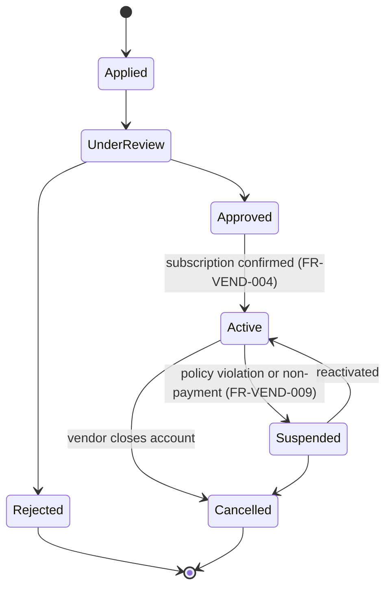
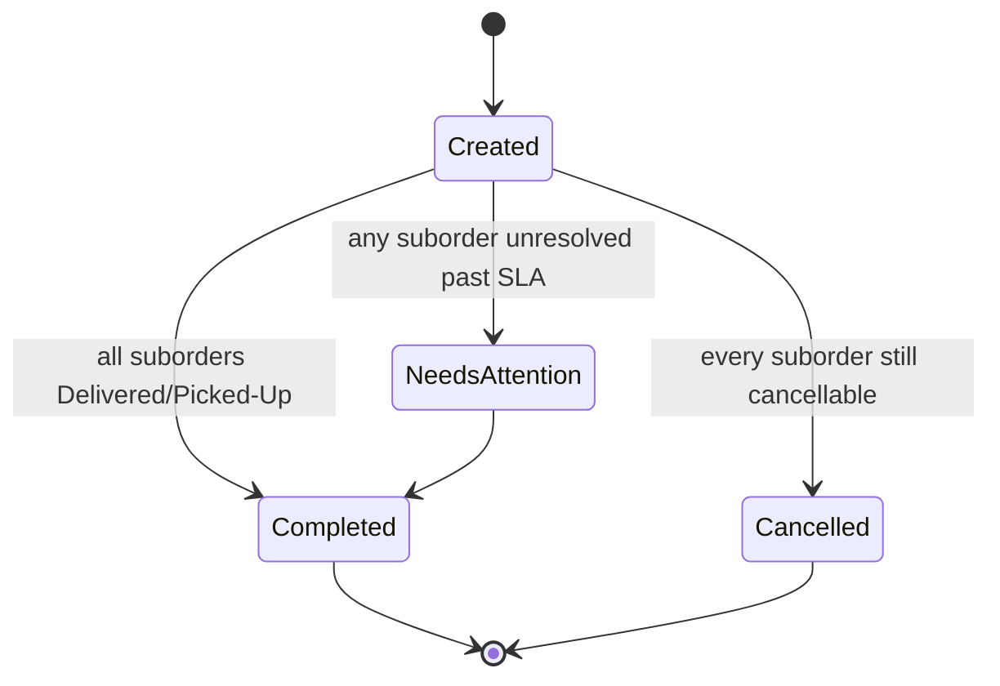
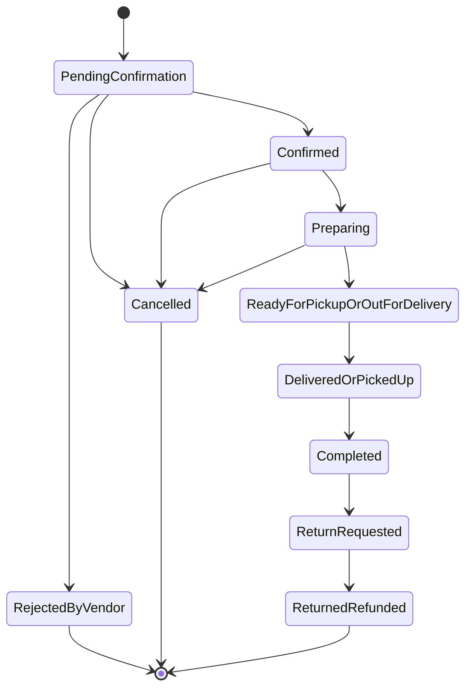
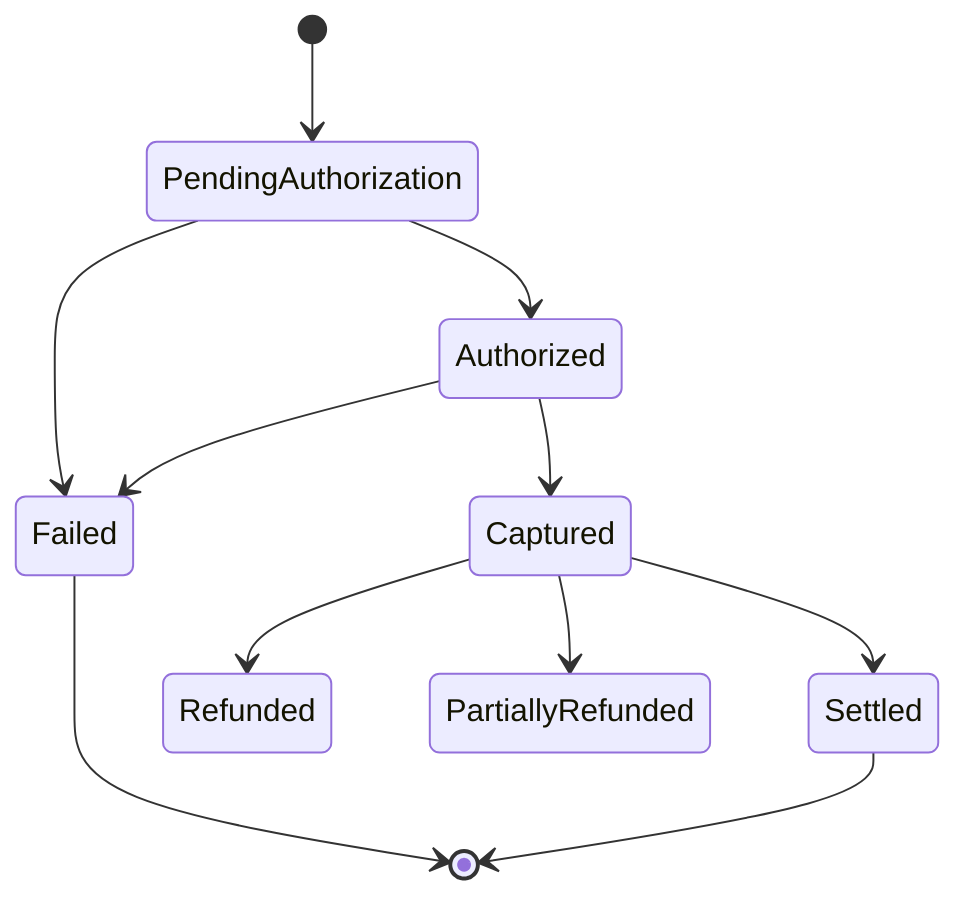

# SRS — Part 2: Functional Requirements (Section E)

Covers Section **E** of the structure required by [`docs/master-prompt.md`](../master-prompt.md), across all 22 modules it names. Builds on [Part 0](00-phase0-scope-and-clarifications.md) (confirmed answers, BR-*, OPEN-001–007) and [Part 1](01-executive-summary-vision-scope.md) (roles, scope, FYP Delivery Increment).

**Language convention:** `must` = mandatory; `should` = strongly recommended, any deviation needs explicit justification; `may` = optional/left to implementation choice.

**Open items convention:** every requirement touched by OPEN-001–007 carries a `⚠ OPEN-00X` tag in its Notes column. These are pending decisions, not settled design — nothing tagged should be built as final until the tagged item is resolved (see Part 0, Section 5). The seven open items, for reference:

| ID | Pending decision |
|---|---|
| OPEN-001 | Licensed, integrable online-payment gateway for the West Bank |
| OPEN-002 | FX-rate source/refresh frequency for cross-currency comparison |
| OPEN-003 | Monthly subscription price tier(s) and grace-period/suspension policy |
| OPEN-004 | SMS/OTP provider for Palestinian phone numbers |
| OPEN-005 | Vendor storefront-verification reviewer assignment and rejection criteria |
| OPEN-006 | Sign-off on the FYP Delivery Increment slice |
| OPEN-007 | Mixed-currency parent-order payment settlement |

---

## E.1 Identity and customer accounts — `FR-AUTH`

| ID | Requirement | Notes |
|---|---|---|
| FR-AUTH-001 | The system must allow guest browsing, search, and comparison without an account. | BR-GUEST (Q13) |
| FR-AUTH-002 | Registration must use phone number + password as the primary credential; email is optional. | Q12 |
| FR-AUTH-003 | The phone number must be verified via one-time password (OTP) at signup before the account can place an order. | ⚠ OPEN-004 |
| FR-AUTH-004 | Checkout must require an authenticated, phone-verified session — no guest checkout. | BR-GUEST (Q13) |
| FR-AUTH-005 | Password reset must be performed via phone-number OTP. | ⚠ OPEN-004 |
| FR-AUTH-006 | OTP must gate sensitive account actions: password reset, phone-number change. | BR-AUTH |
| FR-AUTH-007 | A guest's in-progress cart must persist by session and merge into the account cart on login at checkout. | BR-GUEST |
| FR-AUTH-008 | Customer profile must support multiple saved addresses, each with a map pin, free-text landmark/delivery-note field, and phone number(s). | Supports BR-DELIVERY-CONFIRM's two-phone-number requirement |
| FR-AUTH-009 | The system must support a language preference (Arabic default, English available) persisted per account/session. | — |
| FR-AUTH-010 | The system must support account deletion on request, subject to data-retention rules. | Retention rules pending legal confirmation (Q11) |
| FR-AUTH-011 | The system must rate-limit suspicious login patterns (repeated OTP failures, rapid account creation). | — |
| FR-AUTH-012 | Social login is out of scope for the FYP Delivery Increment and unconfirmed for full MVP. | Revisit post-launch |

---

## E.2 Vendor onboarding and management — `FR-VEND`

| ID | Requirement | Notes |
|---|---|---|
| FR-VEND-001 | A prospective vendor must submit an application with store profile, business information, and at least one branch. | Q8 (nationwide from launch) |
| FR-VEND-002 | A branch declared "physical" must attach a geolocation pin and a storefront photo before the vendor application can be approved. | BR-VENDOR-VERIFICATION, ⚠ OPEN-005 |
| FR-VEND-003 | A vendor-verification-reviewer role must approve, reject, or request resubmission of that evidence; every decision writes an audit record. | ⚠ OPEN-005 (reviewer assignment, rejection criteria) |
| FR-VEND-004 | An approved vendor must select/confirm a monthly subscription plan before catalog publication is allowed. | BR-SUBSCRIPTION, ⚠ OPEN-003 |
| FR-VEND-005 | The system must track vendor subscription status (Active, Past Due, Suspended, Cancelled) and gate storefront/offer visibility accordingly. | ⚠ OPEN-003 |
| FR-VEND-006 | A vendor must manage multiple branches, each with its own hours, holidays/temporary closures, and delivery-zone/service-area configuration. | — |
| FR-VEND-007 | A vendor owner must create/manage vendor-staff accounts (administrator, branch manager, catalog employee, order-processing employee) with role-scoped permissions. | Per Part 1, Section C role table |
| FR-VEND-008 | The system must enforce the vendor status lifecycle below. | See states |
| FR-VEND-009 | A platform admin must be able to suspend/reactivate a vendor with reason capture and an audit record. | — |
| FR-VEND-010 | A vendor must provide payout/settlement information, retained even though launch monetization is subscription-based (not commission), for accuracy and future optionality. | Phase 2 optionality |
| FR-VEND-011 | The system must expose vendor performance indicators (response time, cancellation rate, rating) to the vendor and to platform admins. | — |

**Vendor status lifecycle:**

---

## E.3 Product catalog and taxonomy — `FR-CAT`

| ID | Requirement | Notes |
|---|---|---|
| FR-CAT-001 | Catalog admin must manage a hierarchical category/subcategory tree, each with Arabic and English labels. | — |
| FR-CAT-002 | Brands/manufacturers must be managed as a centrally governed list, with duplicate-name detection at creation time. | Prevents duplicate brands per master-prompt requirement |
| FR-CAT-003 | Each category must support an attribute template (attribute definitions, allowed values, units) used to structure canonical-product specifications. | Drives FR-COMP-003 |
| FR-CAT-004 | Product condition (new, used, refurbished, open-box) must be a controlled value attached to the **offer**, not the canonical product. | See FR-MATCH-008 for the canonical/variant/offer boundary |
| FR-CAT-005 | Product media (images/video) must support per-locale (AR/EN) alt text and a moderation status. | — |
| FR-CAT-006 | Catalog admin must be able to flag/restrict categories or products from publication (e.g., regulated items). | — |
| FR-CAT-007 | Canonical products must support per-locale SEO metadata (title/description). | — |
| FR-CAT-008 | Canonical-product publication must follow the lifecycle Draft → Pending Review → Published → Archived, independent of any individual vendor offer's status. | — |
| FR-CAT-009 | Creating a new brand/category/attribute that closely matches an existing one must trigger a duplicate warning routed to catalog admin for confirmation. | Fuzzy-name check |

---

## E.4 Canonical products and vendor offers — `FR-MATCH`

| ID | Requirement | Notes |
|---|---|---|
| FR-MATCH-001 | Every sellable item must be modeled as either (a) a `VendorOffer` linked to a `CanonicalProduct`, or (b) a standalone/unmatched `VendorOffer` with no canonical link — an offer must never itself be treated as a canonical product. | Explicit anti-pattern called out by the master prompt |
| FR-MATCH-002 | When a vendor offer carries an exact identifier (barcode/GTIN/EAN/UPC/ISBN/MPN) matching an existing canonical product, the system must auto-link it. | Q5 |
| FR-MATCH-003 | Without an exact-identifier match, the offer must enter a match-review queue with a computed confidence score for a product-matching reviewer to approve, reject, or reassign. | Q5 |
| FR-MATCH-004 | A queued/unapproved match must not appear in canonical-product comparison until approved. | Protects comparison integrity |
| FR-MATCH-005 | A customer must be able to report an incorrect live match; reported matches are re-queued. | — |
| FR-MATCH-006 | Catalog/matching admin must be able to merge duplicate canonical products and split an incorrectly-combined one, preserving historical price and order data under the corrected structure. | — |
| FR-MATCH-007 | Every match/merge/split decision must be fully audit-logged (who, when, before/after state, confidence score at decision time). | — |
| FR-MATCH-008 | Color/size/etc. must be modeled at the **variant or offer level, never on the canonical product itself**: the canonical product is the model family, variants are its structural options (e.g., storage size), and the offer is what a specific vendor actually stocks (e.g., which colors that vendor currently carries). | Explicit clarification required by master-prompt Section E.4 |
| FR-MATCH-009 | Unmatched/unique listings (handmade, local, bundles) must remain fully searchable, filterable, and purchasable, clearly labeled as not compared like-for-like. | Resolves Part-1 audit finding |
| FR-MATCH-010 | Conflicting vendor-submitted specifications for the same canonical product must not silently overwrite each other; a source-of-truth policy per field is required. | Finalized alongside Part 3 (data model) and Part 6 (Section N) |

---

## E.5 Product ingestion — `FR-IMPORT`

| ID | Requirement | Notes |
|---|---|---|
| FR-IMPORT-001 | Vendor catalog employees must be able to manually create/edit a single offer via form. | Q6 |
| FR-IMPORT-002 | The system must support bulk CSV/Excel import against a published template, with per-row validation and a downloadable validation report before commit. | Primary ingestion path (Q6) |
| FR-IMPORT-003 | Imports must support partial success — valid rows commit, invalid rows are rejected with reasons, without blocking the batch. | — |
| FR-IMPORT-004 | Full import-job history (who, when, source file, row counts, success/failure breakdown) must be retained per vendor. | — |
| FR-IMPORT-005 | Rejected records must generate actionable vendor-facing error messages. | — |
| FR-IMPORT-006 | Vendor-authorized API/feed ingestion must be supported as an alternative channel, scoped by API credential, for vendors capable of it — never required for onboarding. | Q6/Q15 |
| FR-IMPORT-007 | Scheduled feeds/webhooks and POS/ERP integrations are out of scope for the FYP Delivery Increment and the initial MVP push; supported opportunistically post-launch. | Q6 default |
| FR-IMPORT-008 | Web scraping / uncontrolled ingestion must not be built. | Q15 |
| FR-IMPORT-009 | Data source and freshness (last-updated timestamp, channel) must be recorded per offer and surfaced in comparison. | Feeds FR-COMP-006 |

---

## E.6 Search and discovery — `FR-SEARCH`

| ID | Requirement | Notes |
|---|---|---|
| FR-SEARCH-001 | Full-text search must work in Arabic and English against canonical-product titles, descriptions, brand, and attributes. | — |
| FR-SEARCH-002 | Search must apply Arabic-specific normalization (diacritics, common spelling variants, Arabic/Latin numerals) and basic transliteration matching. | — |
| FR-SEARCH-003 | Search must provide autocomplete and typo-tolerant matching. | — |
| FR-SEARCH-004 | Search must support exact barcode lookup. | — |
| FR-SEARCH-005 | Search must support category navigation, faceted filters (price, brand, attributes, availability, condition, delivery/pickup, distance), and configurable sort. | — |
| FR-SEARCH-006 | Results must be location-aware where the customer has provided/allowed a location. | — |
| FR-SEARCH-007 | The system must track recently viewed products and saved searches per account. | — |
| FR-SEARCH-008 | No-results states must suggest broadened terms/categories rather than a dead end. | — |
| FR-SEARCH-009 | Sponsored/featured results (Phase 2) must be clearly labeled as advertisements and must never silently replace organic relevance ranking. | Phase 2 |
| FR-SEARCH-010 | Unmatched/unique listings must appear in results alongside matched canonical products, visually distinguished. | FR-MATCH-009 |
| FR-SEARCH-011 | Voice search is out of scope for MVP/FYP; future capability only. | — |

---

## E.7 Product comparison — `FR-COMP`

| ID | Requirement | Notes |
|---|---|---|
| FR-COMP-001 | A customer must be able to add/remove items to a comparison set, up to a configurable maximum (recommended default: 4). | — |
| FR-COMP-002 | Comparison must keep two modes clearly distinguished: comparing vendor offers of the *same* canonical product/variant, vs. comparing *different* competing canonical products. | Explicit master-prompt requirement |
| FR-COMP-003 | Comparison attributes must be category-specific (from FR-CAT-003) plus price, discount, size/color, condition, warranty, delivery/pickup, seller rating, distance, and estimated arrival. | — |
| FR-COMP-004 | The system must visually highlight similarities and differences across compared items. | — |
| FR-COMP-005 | The system must label the cheapest offer and, separately, the "best overall value" offer, and must expose *why* an offer earned that label. | Never an opaque black-box label |
| FR-COMP-006 | Comparison must flag stale or missing data rather than silently presenting it as current. | Uses FR-PRICE-002/FR-IMPORT-009 freshness data |
| FR-COMP-007 | Comparison sets must be shareable via link and optionally saved to the account. | — |
| FR-COMP-008 | Comparison UI must be fully usable at mobile widths and in RTL layout. | — |
| FR-COMP-009 | Cross-currency comparisons must display both the vendor's native price and the normalized comparison-currency price, with the FX rate/date disclosed. | ⚠ OPEN-002 |

---

## E.8 Pricing and promotions — `FR-PRICE`

| ID | Requirement | Notes |
|---|---|---|
| FR-PRICE-001 | Each `VendorOffer` must carry a base price, an optional sale price, and a currency. | Q7 |
| FR-PRICE-002 | Full price history with change timestamps must be recorded per offer. | Feeds FR-COMP-006, FR-FAV-003 |
| FR-PRICE-003 | Price-staleness rules must be defined (a price not reconfirmed within N days is flagged stale in comparison). | Exact N is an operational, not code-level, decision |
| FR-PRICE-004 | Vendor discounts, platform promotions, and coupons must have explicit, documented stacking rules before Phase 2 launch. | Phase 2 |
| FR-PRICE-005 | The final payable price must include delivery charge, service fee (if any), and tax handling. | Tax rules pending legal confirmation (Q11) |
| FR-PRICE-006 | Vendors must be able to set a minimum order value per branch/delivery zone. | — |
| FR-PRICE-007 | Cross-vendor comparison must use the FX-normalized comparison price while checkout charges the customer in the vendor's native currency. | ⚠ OPEN-002, ⚠ OPEN-007 |
| FR-PRICE-008 | Flash sales, bundle pricing, and quantity discounts are Phase 2 scope. | Not required for FYP/initial MVP |
| FR-PRICE-009 | Sponsored placement (paid ranking boost) is Phase 2 and must always be transparently labeled. | Consistent with FR-SEARCH-009 |

---

## E.9 Inventory and availability — `FR-INV`

| ID | Requirement | Notes |
|---|---|---|
| FR-INV-001 | Inventory must be tracked at branch level (and variant level where applicable) per vendor offer. | — |
| FR-INV-002 | The system must support the availability states below. | See states |
| FR-INV-003 | Checkout must reserve inventory with a configurable reservation-expiry window. | Reduces oversell risk in a multi-vendor cart |
| FR-INV-004 | Checkout must be blocked for any offer that has gone Out of Stock since being added to the cart, with clear messaging and a remove/replace option for just that item. | See Part 5 edge cases |
| FR-INV-005 | Vendor/branch staff must be able to manually update stock; API sync is supported where an integration exists but is not required. | FR-IMPORT-006 |
| FR-INV-006 | Inventory must be flagged stale after a configurable no-update window, distinct per ingestion channel. | — |
| FR-INV-007 | Vendors must be able to configure a safety-stock buffer to reduce oversell risk on manually tracked inventory. | — |
| FR-INV-008 | The system must support periodic inventory-reconciliation reporting to vendors. | — |

**Availability states:** `Unknown → {In Stock, Low Stock, Out of Stock, Preorder, Backorder, Available on Request}`. On cart add: `In Stock → Reserved` (temporary); on reservation expiry: `Reserved → In Stock`; on order confirmation depleting stock: `Reserved → Out of Stock` (or back to In Stock/Low Stock if stock remains).

---

## E.10 Cart and checkout — `FR-CART`

| ID | Requirement | Notes |
|---|---|---|
| FR-CART-001 | The cart must support items from multiple vendors simultaneously, automatically partitioned by vendor for checkout. | Q1 |
| FR-CART-002 | Checkout must revalidate price and inventory for every cart line against current vendor-offer data immediately before payment/order creation. | — |
| FR-CART-003 | Checkout must validate each vendor's minimum order value per vendor partition. | FR-PRICE-006 |
| FR-CART-004 | Checkout must validate delivery-address eligibility per vendor's declared service area; a vendor outside the area is still checkout-eligible via pickup. | — |
| FR-CART-005 | The customer must be able to choose delivery or pickup independently per vendor within the same checkout. | Q4 |
| FR-CART-006 | Order confirmation must collect the customer's home-location pin and two phone numbers (plus optional delivery notes) before the order can be finalized. | BR-DELIVERY-CONFIRM |
| FR-CART-007 | Coupon application (platform-wide or vendor-specific) must apply per relevant vendor partition. | Phase 2 feature; cart structure must not preclude it |
| FR-CART-008 | Checkout submission must be idempotent — a duplicate submission must not create duplicate orders. | Idempotency key, detailed in Part 4 |
| FR-CART-009 | Final confirmation must support both cash on delivery and online payment. | ⚠ OPEN-001, ⚠ OPEN-007 — data model must not require restructuring once resolved |
| FR-CART-010 | Abandoned carts must not have side effects; cart-recovery notifications are optional (Phase 2). | — |
| FR-CART-011 | Checkout submission must materialize the cart into one `CustomerOrder` containing one `VendorSuborder` per vendor partition. | BR/Q2 |

---

## E.11 Orders — `FR-ORD`

| ID | Requirement | Notes |
|---|---|---|
| FR-ORD-001 | Each completed checkout must create exactly one `CustomerOrder`, one `VendorSuborder` per represented vendor, and one or more `OrderItem`s per suborder. | — |
| FR-ORD-002 | Each `VendorSuborder` must progress through its own fulfillment lifecycle independently of sibling suborders. | — |
| FR-ORD-003 | One vendor rejecting/cancelling their suborder must not cancel sibling suborders in the same order. | Full failure-mode catalogue in Part 5 |
| FR-ORD-004 | Every state transition (order, suborder, item, payment, delivery, return) must be attributed to a responsible actor, trigger the relevant notification, and write an audit record. | — |
| FR-ORD-005 | The customer must see a consolidated order timeline showing the parent order and each vendor suborder's independent status. | — |
| FR-ORD-006 | Cancellation eligibility must be governed by the suborder's current state (cancellable while Pending/Confirmed, not once Out for Delivery). | Full rule set in Part 3, Section F |
| FR-ORD-007 | Vendor-facing suborder actions must be consistent with role permissions (order-processing employee updates status; cancellation after dispatch requires vendor owner/admin or platform admin). | Part 1, Section C |

**`CustomerOrder` state machine:**

**`VendorSuborder` state machine:**

**`OrderItem` state:** mirrors its parent suborder for most purposes, but supports independent state for **partial** returns/refunds — one item can be Returned while sibling items in the same suborder remain Completed.

**Payment state machine:**

COD uses a simplified path: `Pending → Collected on Delivery → Settled`. ⚠ OPEN-001, ⚠ OPEN-007 apply to the online-payment branch.

**Delivery state machine:** `Assigned → Out for Delivery → {Delivered, Failed Attempt → re-Assigned, Cancelled}`, with Proof of Delivery captured on Delivered.

**Return state machine:** see E.14 below.

---

## E.12 Payment and settlement — `FR-PAY`

| ID | Requirement | Notes |
|---|---|---|
| FR-PAY-001 | The system must support cash on delivery, with collection confirmation recorded by the delivering party. | — |
| FR-PAY-002 | The system must support online payment authorization and capture against a confirmed gateway. | ⚠ OPEN-001 — FYP uses a sandbox/simulated flow (Part 1, D.4) |
| FR-PAY-003 | A multi-vendor order's payment must be split/allocated per vendor suborder for settlement, regardless of whether the customer experiences one combined charge or per-vendor charges. | ⚠ OPEN-007 |
| FR-PAY-004 | The system must support full and partial refunds tied to specific order items/suborders, with delivery-fee treatment defined per return reason. | Part 3, Section F |
| FR-PAY-005 | Vendor commission/fee application is recorded but not charged under the confirmed subscription-based model; the data model must not preclude a future commission field. | BR-SUBSCRIPTION, Phase 2 optionality |
| FR-PAY-006 | Vendor subscription billing must be tracked as its own payment stream, independent of customer-order payments. | ⚠ OPEN-003 |
| FR-PAY-007 | Every payment/refund/settlement event must be recorded in an immutable, attributable financial audit log. | — |
| FR-PAY-008 | Invoice/receipt generation must be supported for customer orders and vendor subscription billing. | Exact tax-invoice fields pending legal confirmation (Q11) |
| FR-PAY-009 | A payment that succeeds but order creation subsequently fails (or vice versa) must trigger compensating reconciliation — never a silent loss of the customer's money or a silently-uncharged order. | See Part 5 edge cases |
| FR-PAY-010 | Chargeback handling for online payments depends on the eventual gateway's process and cannot be fully specified yet. | ⚠ OPEN-001 |

---

## E.13 Fulfillment and delivery — `FR-FUL`

| ID | Requirement | Notes |
|---|---|---|
| FR-FUL-001 | Each `VendorSuborder` must declare its fulfillment method at checkout: vendor delivery or customer pickup from a specific branch. | Q4 |
| FR-FUL-002 | Vendor delivery must follow the Delivery state machine (E.11); third-party courier integration is Phase 2. | Q4 default |
| FR-FUL-003 | Order confirmation must trigger BR-DELIVERY-CONFIRM: capture of home-location pin + two phone numbers, then three notifications (vendor-portal alert, SMS to the store's number, SMS to the customer-entered number). | ⚠ OPEN-004 — see Part 1, D.4 for the FYP fallback behavior |
| FR-FUL-004 | Delivery-zone eligibility must be checked per branch (map-based or governorate/city list), consistent with nationwide rollout. | Q8 |
| FR-FUL-005 | Delivery-fee calculation per vendor/zone must feed into FR-PRICE-005's final payable price. | — |
| FR-FUL-006 | Failed-delivery handling (customer unavailable, wrong address) must have a defined retry/reschedule flow with clear messaging. | — |
| FR-FUL-007 | Split deliveries within a single suborder are supported only where the vendor explicitly enables partial shipment; default is one shipment per suborder. | — |
| FR-FUL-008 | Pickup orders must generate a customer-facing pickup code the branch can verify at hand-off. | — |
| FR-FUL-009 | Return pickups follow the delivery-state machine in reverse, tied to the return workflow. | FR-RET |

---

## E.14 Cancellations, returns, refunds, and disputes — `FR-RET`

| ID | Requirement | Notes |
|---|---|---|
| FR-RET-001 | Return eligibility must be defined by time window and reason code, configurable per category. | Any consumer-protection minimums pending legal confirmation (Q11) |
| FR-RET-002 | A customer must be able to submit a return/cancellation request with reason and optional photo evidence, scoped to specific order items. | Partial returns supported |
| FR-RET-003 | The vendor must approve/reject the return request within an SLA; unresolved requests auto-escalate to platform support. | FR-SUP |
| FR-RET-004 | Refund calculation must account for delivery-fee treatment, restocking, and payment method (COD vs. online). | Rules finalized in Part 3, Section F |
| FR-RET-005 | Distinct reason categories (damaged, wrong item, counterfeit claim, warranty claim, change of mind) may route to different SLA/approval paths. | — |
| FR-RET-006 | Unresolved disputes must be escalatable to platform support with full order/communication history visible to the agent. | — |
| FR-RET-007 | Abuse-prevention limits (anomalous return-rate flags) must route to operations-manager review, not automatic penalty on a single instance. | — |

**Return state machine:** `Requested → Vendor Review → {Approved → Refund Processing → Refunded, Rejected → (Escalated to Support → resolved either way)}`; approval also triggers `OrderItem → Returned` (E.11) and, where applicable, `Inventory: Out of Stock/Low Stock → restocked` (E.9).

---

## E.15 Ratings, reviews, and trust — `FR-REV`

| ID | Requirement | Notes |
|---|---|---|
| FR-REV-001 | Only a customer with a verified completed purchase of the specific offer may review it. | "Verified purchase" |
| FR-REV-002 | Reviews must support separate targets: product (offer/canonical product), vendor/store, and delivery experience. | — |
| FR-REV-003 | Reviews may include images, subject to content moderation. | FR-ADMIN moderation queue |
| FR-REV-004 | A vendor may post one public response per review. | — |
| FR-REV-005 | Aggregate rating scores (product and vendor level) must use a documented formula resistant to obvious manipulation (e.g., a minimum-review-count threshold before public display). | Formula finalized in Part 6, Section O |
| FR-REV-006 | Any user must be able to report a review for abuse, routing it to the content-moderator queue. | — |
| FR-REV-007 | Anomalous review patterns (rating bursts from new accounts) must be flagged for moderator attention. | Full approach in Part 6 |
| FR-REV-008 | The vendor-verification badge (from FR-VEND-003) must be visibly displayed on the store page as a trust signal. | — |

---

## E.16 Favorites and alerts — `FR-FAV`

| ID | Requirement | Notes |
|---|---|---|
| FR-FAV-001 | A registered customer must be able to favorite a canonical product, a specific vendor offer, or a store. | — |
| FR-FAV-002 | A customer must be able to save a comparison set. | FR-COMP-007 |
| FR-FAV-003 | The system must support price-drop alerts on favorited offers, driven by price-history tracking. | FR-PRICE-002 |
| FR-FAV-004 | The system must support back-in-stock alerts on favorited offers that are Out of Stock. | — |
| FR-FAV-005 | A customer must control notification preferences and alert frequency. | FR-NOTIF |

---

## E.17 Notifications and communication — `FR-NOTIF`

| ID | Requirement | Notes |
|---|---|---|
| FR-NOTIF-001 | The system must support SMS, email, and in-app/push channels, each independently trackable for delivery/failure per notification instance. | Needed for BR-DELIVERY-CONFIRM's three-notification rule |
| FR-NOTIF-002 | SMS is the primary channel for OTP and order-confirmation messages. | ⚠ OPEN-004 — no channel-specific requirement can be finalized until resolved |
| FR-NOTIF-003 | All customer-facing notification templates must exist in Arabic and English, selected per the recipient's language preference. | FR-AUTH-009 |
| FR-NOTIF-004 | Failed notification delivery must retry per a defined policy, and every delivery attempt must be logged. | Supports the FYP "recorded vs. externally delivered" distinction (Part 1, D.3) |
| FR-NOTIF-005 | Direct customer-vendor communication must not expose either party's raw phone number beyond what the order-confirmation flow already shares by design. | Governs any additional in-app messaging channel added later |
| FR-NOTIF-006 | WhatsApp as a channel is out of scope unless an official WhatsApp Business API relationship is confirmed. | Not assumed available |

---

## E.18 Customer support — `FR-SUP`

| ID | Requirement | Notes |
|---|---|---|
| FR-SUP-001 | A customer or vendor must be able to open a support ticket, optionally linked to a specific order/suborder. | — |
| FR-SUP-002 | Tickets must support category, priority, internal notes (not visible to the submitter), and attachments. | — |
| FR-SUP-003 | SLA per ticket priority must be tracked, with breach escalation to the operations manager. | — |
| FR-SUP-004 | A support agent must be able to authorize a refund within a configured limit; above it, escalation to finance/platform admin is required. | FR-PAY-004 |
| FR-SUP-005 | A support agent must see a consolidated customer timeline scoped to what the ticket needs. | Part 1, Section C data-visibility boundary |
| FR-SUP-006 | A public, bilingual knowledge base/FAQ must be supported to reduce ticket volume. | — |

---

## E.19 Administration portal — `FR-ADMIN`

| ID | Requirement | Notes |
|---|---|---|
| FR-ADMIN-001 | Platform admin must have centralized management screens for every admin-scope entity named in the master prompt (customers, vendors, branches, catalog, matching, imports, categories, attributes, brands, orders, payments, settlements, returns, disputes, reviews, promotions, advertising, content pages, delivery zones, notifications, support tickets, roles/permissions, feature flags, configuration, audit logs, dashboards, fraud signals, data exports). | — |
| FR-ADMIN-002 | Every business-facing selectable list must be centrally configurable, never hardcoded. | Explicit master-prompt requirement |
| FR-ADMIN-003 | Role/permission management must be admin-configurable on the Section C role set, with changes audit-logged. | — |
| FR-ADMIN-004 | Feature flags must be supported to stage Phase-2+ capabilities without a full deployment. | — |
| FR-ADMIN-005 | Audit-log search/export must be available across all tracked entities. | — |
| FR-ADMIN-006 | Fraud-signal dashboards (suspicious logins, anomalous reviews, anomalous return rates) must be surfaced from the relevant modules. | — |
| FR-ADMIN-007 | Data export must be supported for operational/financial reporting. | — |

---

## E.20 Vendor portal — `FR-VPORTAL`

| ID | Requirement | Notes |
|---|---|---|
| FR-VPORTAL-001 | The vendor dashboard must summarize orders needing attention, subscription status, and KPIs. | FR-VEND-011 |
| FR-VPORTAL-002 | Vendors must manage products/offers, variants, inventory, and pricing through the portal. | FR-CAT/FR-MATCH/FR-INV/FR-PRICE |
| FR-VPORTAL-003 | Vendors must run bulk imports and view import history/error reports. | FR-IMPORT-002 |
| FR-VPORTAL-004 | Vendors must manage incoming orders/suborders, including cancellations and returns. | FR-ORD/FR-RET, role-scoped |
| FR-VPORTAL-005 | Vendors must manage branches and staff accounts. | FR-VEND-006/007 |
| FR-VPORTAL-006 | Vendors must view subscription billing status and history. | FR-PAY-006, ⚠ OPEN-003 |
| FR-VPORTAL-007 | Vendors must view performance/SLA reports and respond to reviews. | FR-REV-004 |
| FR-VPORTAL-008 | Vendors must manage integration credentials for any vendor-authorized API ingestion. | FR-IMPORT-006 |
| FR-VPORTAL-009 | Vendors must configure store settings (hours, closures, delivery zones per branch, notification preferences). | — |

---

## E.21 Content management and marketing — `FR-CMS`

| ID | Requirement | Notes |
|---|---|---|
| FR-CMS-001 | Marketing role must manage home-page sections, banners, and featured-store/product placements, bilingual, with draft/preview/scheduled-publish. | — |
| FR-CMS-002 | Campaign pages and SEO content pages must support Arabic and English content independently. | Not forced translation |
| FR-CMS-003 | Sponsored/paid placement must be visually labeled as an advertisement. | Consistent with FR-SEARCH-009/FR-PRICE-009 |
| FR-CMS-004 | Referral/affiliate programs are Phase 2+ scope. | Not required for MVP/FYP |
| FR-CMS-005 | Content must support deep links into both the web app and mobile builds. | Q9 |

---

## E.22 Analytics and reporting — `FR-ANALYTICS`

| ID | Requirement | Notes |
|---|---|---|
| FR-ANALYTICS-001 | Role-scoped dashboards (platform, vendor, finance, operations, support, marketing) must draw on the KPIs defined in Part 1, Section B. | — |
| FR-ANALYTICS-002 | Catalog-quality and product-matching-quality reports must be available to catalog/matching admins. | — |
| FR-ANALYTICS-003 | Inventory-accuracy and price-freshness reports must be available to vendors (own data) and platform admins (aggregate). | — |
| FR-ANALYTICS-004 | Search-performance reporting (zero-result rate, top queries) must be available to catalog/platform admins. | — |
| FR-ANALYTICS-005 | Orders/revenue, subscription-billing, and returns reporting must be available to finance/platform admins, each metric's formula and source data documented alongside it. | Full formulas in Part 6, Section O |
| FR-ANALYTICS-006 | Customer-behavior funnel analytics (search → comparison → cart → checkout) must be available to evaluate the FYP Delivery Increment's exit-criteria demo and beyond. | Part 1, D.3 |

---

## Open items referenced in this part

| OPEN ID | Referenced by |
|---|---|
| OPEN-001 | FR-CART-009, FR-PAY-002, FR-PAY-010 |
| OPEN-002 | FR-COMP-009, FR-PRICE-007 |
| OPEN-003 | FR-VEND-004, FR-VEND-005, FR-PAY-006, FR-VPORTAL-006 |
| OPEN-004 | FR-AUTH-003, FR-AUTH-005, FR-FUL-003, FR-NOTIF-002 |
| OPEN-005 | FR-VEND-002, FR-VEND-003 |
| OPEN-006 | Governs which of the above are built in the FYP window vs. deferred — see Part 1, D.4 |
| OPEN-007 | FR-CART-009, FR-PAY-003, FR-PRICE-007 |

None of these block Part 3 — every tagged requirement remains valid as a *design target*; only its production-integration details wait on the tagged decision.

---

**Next:** Part 3 will cover Section F (Business rules catalog, `BR-xxx`) and Section G (Data model), formalizing the entities (`CanonicalProduct`, `VendorOffer`, `CustomerOrder`, `VendorSuborder`, etc.) referenced throughout this part.
