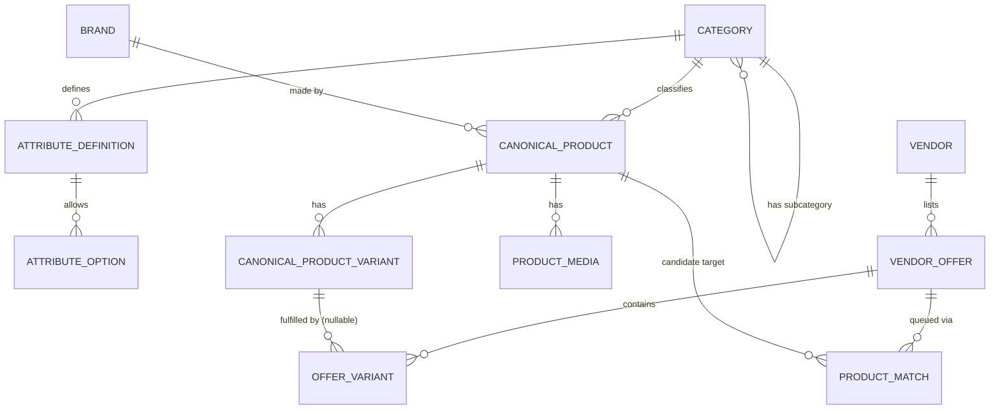
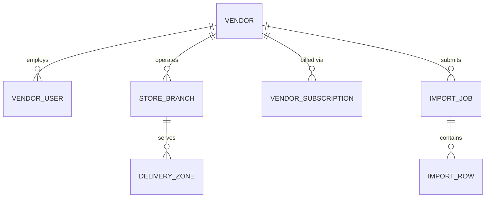
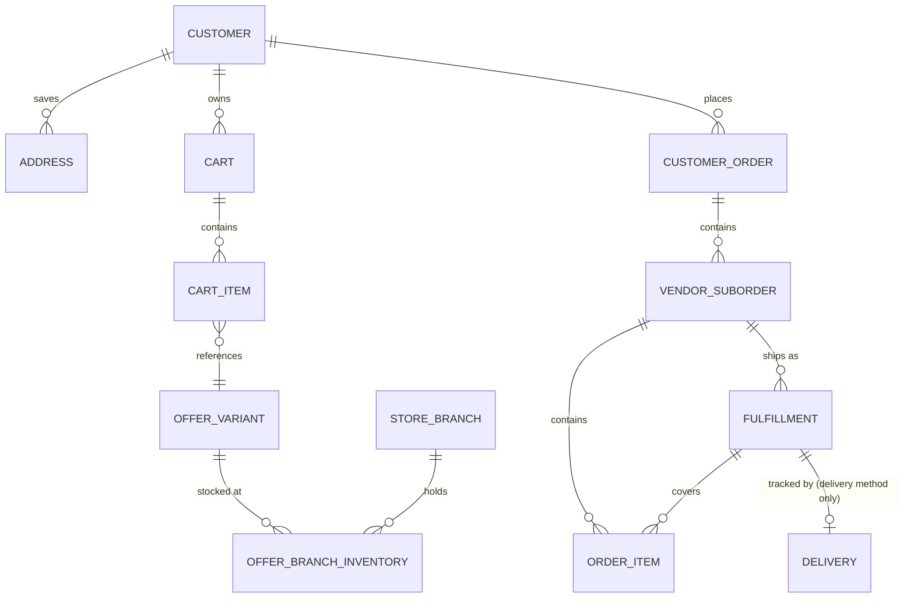
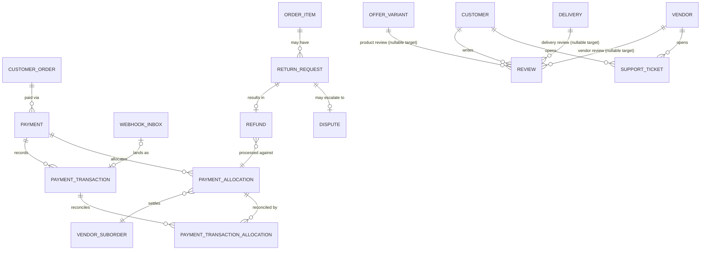

# SRS — Part 3: Business Rules Catalog (Section F) & Data Model (Section G)

Builds on [Part 0](00-phase0-scope-and-clarifications.md), [Part 1](01-executive-summary-vision-scope.md), and [Part 2](02-functional-requirements.md). Numeric `BR-0xx` IDs are the canonical form the master prompt asks for; the mnemonic names already used in Parts 0–2 (`BR-DELIVERY-CONFIRM`, etc.) are kept as aliases so nothing already written needs renaming.

**Carried-forward item from the Part-2 review:** Codex flagged that `OrderItem` should not have to wait for its whole `VendorSuborder` to complete before it can be returned, since split shipment (FR-FUL-007) means sibling items can be delivered at different times. This is resolved below by making `Fulfillment` — not `VendorSuborder` — the thing an `OrderItem` actually waits on (BR-025, and the `Fulfillment`/`OrderItem` entities in Section G). This **refines** Part 2's `OrderItem` state machine: "parent suborder reaches Completed" becomes "the item's own `Fulfillment` reaches Delivered/PickedUp." When `splitShipment = false` (the default), a suborder has exactly one `Fulfillment` covering every item, which reproduces Part 2's original behavior exactly — so nothing in Part 2 was wrong, it described the single-fulfillment special case.

---

## F. Business rules catalog

| ID | Alias | Rule | Example | Exception(s) |
|---|---|---|---|---|
| BR-001 | — | An exact product identifier (barcode/GTIN/EAN/UPC/ISBN/MPN) match between a vendor offer and an existing `CanonicalProductVariant` auto-links the offer; any other match must be human-approved before it affects comparison or search. | A vendor CSV row with GTIN `0194253...` matching an existing variant auto-links on import. | None — this is the one matching path allowed to bypass human review (FR-MATCH-002/003). |
| BR-002 | — | A vendor may create, edit, or delete only its own `Vendor`, `StoreBranch`, `VendorOffer`, and `OfferVariant` records. `CanonicalProduct`, `CanonicalProductVariant`, and taxonomy (`Category`/`Brand`/`AttributeDefinition`) are platform-owned and never vendor-editable. | A vendor can change its own offer's price; it cannot rename the canonical "Samsung Galaxy A55" product. | Catalog admin may edit vendor-authored free-text fields only when resolving a moderation/duplicate issue, and only with an audit record. |
| BR-003 | — | Every business-facing selectable list (categories, attributes, return reasons, ticket categories, etc.) is centrally admin-configurable — no such list may be hardcoded in application code. | Adding a new return reason is a catalog-admin action, not a deployment. | None (explicit master-prompt requirement, FR-ADMIN-002). |
| BR-004 | — | A price not reconfirmed within the configured staleness window is flagged stale in comparison and search, never silently presented as current. | A manually entered price untouched for 30+ days shows a "price may be outdated" badge. | API/feed-synced offers may use a shorter or longer window than manually entered ones (FR-PRICE-003). |
| BR-005 | — | Inventory not updated within its channel-specific freshness window is flagged stale; a stale Out-of-Stock/In-Stock value must not be treated as ground truth for checkout blocking without a fresher revalidation at cart time (FR-CART-002). | A manual-entry offer untouched for 7 days shows "availability unconfirmed" pending checkout-time revalidation. | None. |
| BR-006 | — | A vendor offer is only checkout-eligible for delivery if the customer's address falls inside that branch's declared delivery zone; pickup is always eligible regardless of zone. | A customer outside Nablus governorate can still pick up from a Nablus branch. | None. |
| BR-007 | — | Only approved (auto- or human-matched) offers participate in like-for-like canonical-product comparison. Unmatched/unique offers are searchable and purchasable but excluded from comparison, and must never be silently linked to a canonical product to make them comparable. | A handmade leather bag is not shown next to factory-made bags in a "compare" table. | None (FR-MATCH-004/009). |
| BR-008 | — | Platform promotions, vendor discounts, and coupons stack only per an explicit, documented combination table; undocumented combinations default to "do not stack" (apply the single largest discount). | — | Phase 2 feature; not built for MVP/FYP (FR-PRICE-004, FR-PRICE-008). |
| BR-009 | — | A cart's items are partitioned by vendor at all times; every checkout validation (minimum order, delivery eligibility, fulfillment choice) runs per partition, never against the cart as an undifferentiated whole. | A ₪50 vendor minimum blocks only that vendor's partition, not the whole checkout. | None (FR-CART-001/003, Q1). |
| BR-010 | — | A `CustomerOrder` and all of its `VendorSuborder`/`OrderItem` rows are created atomically from one checkout submission — a partial write (order created but a suborder missing) is not a valid end state and must be rolled back or reconciled (FR-PAY-009 covers the payment-side version of this). | — | None. |
| BR-011 | — | A `VendorSuborder` is cancellable by the customer only while `PendingConfirmation` or `Confirmed`; by the vendor while `PendingConfirmation` through `Preparing`; never once `ReadyForPickup`/`OutForDelivery` or later (FR-ORD-006). | — | Platform admin override is permitted for exceptional cases, always audit-logged (BR-019). |
| BR-012 | — | Return eligibility is a time window + reason-code combination configurable per category; the default window applies where a category defines none. | — | Any consumer-protection minimum window is pending legal confirmation (Q11) — do not assert a specific number as compliant without that confirmation. |
| BR-013 | ⚠ **Proposed default — pending OPEN-007, not binding** | Refund amount = item price + proportional share of delivery fee if the delivery-fee-refund policy for that return reason says so, minus any restocking adjustment; **proposed** to be computed in the currency the item was purchased in, pending OPEN-007. | A "wrong item" return refunds the delivery fee; a "change of mind" return may not, per configured policy. | This entire rule is a proposed default, not a confirmed decision: mixed-currency parent orders' refund currency/amount and FX-movement handling are undecided — ⚠ **OPEN-007** — and this row must not be implemented as final until that's resolved. |
| BR-014 | Formalizes **BR-SUBSCRIPTION** | Vendor storefront/offer visibility is gated on an Active subscription status, not on any per-order commission — a vendor Past Due enters a grace period before Suspended (FR-VEND-004/005). | — | Grace-period length and price tiers are undecided — ⚠ **OPEN-003**. The data model reserves an optional commission field for Phase 2 without requiring its use now (FR-PAY-005). |
| BR-015 | — | Vendor subscription billing and customer-order payment are settled on independent cycles/records — a subscription lapse never retroactively affects an already-placed customer order. | — | — |
| BR-016 | — | A customer may only review a specific `OfferVariant` after a `CustomerOrder`/`OrderItem` referencing it has reached Completed ("verified purchase") — no review without a matching completed item. | — | None (FR-REV-001). |
| BR-017 | — | A vendor is auto-flagged for admin review (not auto-suspended) on: subscription past-due past its grace period, an anomalous return-rate spike, or a verification-evidence rejection with no resubmission within a configured window. Suspension itself is always an explicit admin action with a recorded reason. | — | None (FR-VEND-009). |
| BR-018 | — | Customer/vendor account deletion honors a defined retention period for order, payment, and audit records even after the account itself is deleted (soft-deleted, PII redacted, transactional records kept for the retention period). | — | Exact retention periods pending legal confirmation (Q11). |
| BR-019 | — | Any administrative action that bypasses a normal permission boundary ("break-glass") must capture a reason at the time of the action and is always audit-logged; there is no silent admin override anywhere in the system. | — | None. |
| BR-020 | Formalizes **BR-DELIVERY-CONFIRM** | Order confirmation requires a home-location pin and two phone numbers from the customer, and fires three independently tracked notifications: vendor-portal in-app alert, SMS to the store's registered number, SMS to the customer-entered number. | — | ⚠ **OPEN-004** (SMS/OTP provider) — see Part 1, D.4 for the FYP fallback behavior. |
| BR-021 | Formalizes **BR-CURRENCY**; ⚠ **the checkout-currency clause is a proposed default — pending OPEN-007, not binding** | Each `VendorOffer`/`OfferVariant` prices in the vendor's own currency, and comparison ranking uses an FX-normalized price in the platform base currency (ILS) — both of these parts are confirmed (Q7). **Proposed, not yet confirmed:** checkout charges the customer in the vendor's native currency (per suborder) rather than some blended/converted amount — this is only a working default until OPEN-007 decides how a mixed-currency parent order is actually charged and settled. | A ₪-priced and a JOD-priced offer for the same canonical variant both show an ILS-equivalent "comparison price" alongside their native price. | ⚠ **OPEN-002** (FX source/refresh, affects the confirmed comparison-normalization clause) and ⚠ **OPEN-007** (affects only the proposed checkout-currency clause) both remain open — implement the confirmed clauses now, treat the checkout-currency clause as provisional. |
| BR-022 | Formalizes **BR-VENDOR-VERIFICATION** | A `StoreBranch` flagged as physical cannot leave "pending verification" without an attached geolocation pin and storefront photo, reviewed and approved by a vendor-verification reviewer. | — | ⚠ **OPEN-005** — reviewer *assignment* is still open; the rejection-consequence half is resolved by BR-026. |
| BR-023 | Formalizes **BR-AUTH** | Phone number + password is the primary credential; OTP verifies the phone at signup and gates password reset and phone-number change. | — | ⚠ **OPEN-004**. |
| BR-024 | Formalizes **BR-GUEST** | Guests may search/browse/compare and build a cart unauthenticated; checkout requires an authenticated, phone-verified session; a guest cart merges into the account cart on login. | — | None. |
| BR-025 | **New — resolves the Part-2 carry-forward item** | An `OrderItem`'s eligibility to enter `ReturnRequested` depends only on its own `Fulfillment` reaching `Delivered`/`PickedUp` — never on sibling items or the parent `VendorSuborder` as a whole reaching Completed. Split shipment (FR-FUL-007) therefore lets one item become returnable while a sibling item, shipped separately, is still in transit. | A 2-item suborder ships item A this week and item B next week (`splitShipment = true`); item A becomes Completed/returnable on its own delivery, independent of item B's still-open `Fulfillment`. | When `splitShipment = false` (default), a suborder has exactly one `Fulfillment` covering all its items, so they complete together — reproducing Part 2's original single-shipment behavior as the default case of this more general rule. |
| BR-026 | **New — emergent decision from Sprint 3 implementation/review, resolves OPEN-005's "rejection criteria" half** | A vendor-verification reviewer **rejecting** any one of a vendor's physical branches' verification evidence (FR-VEND-003) rejects the vendor's entire application (`UNDER_REVIEW` → `REJECTED`) — there is no per-branch partial-rejection state at the vendor level. `request_resubmission` (distinct from `reject`) remains the path for evidence that's merely incomplete or needs correction, without rejecting the application — it leaves the vendor `UNDER_REVIEW` and lets that specific branch's evidence be resubmitted. This rule covers only the reject → whole-application-rejected mapping itself; whether, and how, a vendor may submit a **new** application after a rejection is a separate, still-open question — see ⚠ **OPEN-010** — not something this rule decides either way. | A reviewer rejects one of a vendor's three physical branches (e.g., the storefront photo doesn't match the map pin) — the whole application is rejected, even though the other two branches were already approved. | Reviewer assignment (the other half of OPEN-005) remains open — see Part 7, Q.4/BDR-016. Post-rejection reapplication policy is tracked separately as ⚠ **OPEN-010** (Part 7, Q.4) — the current build has no reapplication flow, but that reflects Sprint 3's scope, not a confirmed decision that one will never exist. |

---

## G. Data model

### G.1 Structural anti-pattern prevention (explicit master-prompt requirement)

`CanonicalProduct` and `CanonicalProductVariant` carry **no `vendor_id` column, ever** — this is enforced by the schema, not just convention. Every vendor-owned record (`VendorOffer`, `OfferVariant`, `OfferBranchInventory`, `PriceHistory`) carries a mandatory `vendor_id`. A vendor offer can only ever *reference* a canonical variant via `OfferVariant.canonical_variant_id` (nullable, for unmatched listings) — it can never *become* one. This is the concrete technical enforcement of FR-MATCH-001/BR-002.

### G.2 Conceptual entity-relationship diagrams

**Catalog & matching:**

**Vendor & onboarding:**

**Cart, order & fulfillment (note: `Fulfillment`, not `VendorSuborder`, is what `OrderItem` waits on — BR-025):**

**Payment, trust & support** (note: `PaymentAllocation` is what lets one parent `Payment` settle per `VendorSuborder`, per-currency — see G.3 and ⚠ OPEN-007):

### G.3 Entity reference

Ownership: **Platform** = catalog/platform admin only · **Vendor** = the owning vendor (scoped) · **Customer** = the owning customer (scoped) · **System** = written only by application logic, never directly editable.

#### Identity & vendor domain

| Entity | Key fields | Unique constraints | FKs | Ownership | Audit / retention |
|---|---|---|---|---|---|
| `User` | phone, password_hash, email (nullable), language_pref, phone_verified_at | phone (unique) | — | Self | Full audit on auth events (BR-023); retained per BR-018 |
| `CustomerProfile` | user_id, display_name | — | user_id → User | Self | — |
| `Address` | label, lat, lng, landmark_note, phone_number_1, phone_number_2 | — | customer_id → CustomerProfile | Self | Supports BR-020's two-phone-number requirement |
| `Vendor` | legal_name, status (BR/FR-VEND lifecycle), subscription_status | — | — | Vendor (own record, admin override) | Full audit on status transitions (E.11-style pattern applied to FR-VEND-008) |
| `VendorUser` | user_id, vendor_id, role | (user_id, vendor_id) unique | user_id → User, vendor_id → Vendor | Vendor | — |
| `StoreBranch` | name, is_physical, lat, lng, verification_photo_url, verification_status, hours, closures | — | vendor_id → Vendor, reviewed_by → User (nullable) | Vendor (edit), Platform (verify) | Verification decision audit-logged (BR-022) |
| `DeliveryZone` | branch_id, zone_definition (governorate/city list or polygon), delivery_fee | — | branch_id → StoreBranch | Vendor | — |
| `VendorSubscription` | vendor_id, plan, status, period_start, period_end, grace_deadline | — | vendor_id → Vendor | System (billing), Finance (admin) | ⚠ OPEN-003 for plan/grace-period values |

#### Catalog & matching domain

| Entity | Key fields | Unique constraints | FKs | Ownership | Audit / retention |
|---|---|---|---|---|---|
| `Category` | name_ar, name_en, parent_id | — | parent_id → Category (self) | Platform | — |
| `Brand` | name, normalized_name | normalized_name (unique, duplicate-check per FR-CAT-002) | — | Platform | — |
| `AttributeDefinition` | category_id, name, data_type, unit | (category_id, name) unique | category_id → Category | Platform | — |
| `AttributeOption` | attribute_definition_id, value | — | attribute_definition_id → AttributeDefinition | Platform | — |
| `CanonicalProduct` | brand_id, category_id, model_name, product_type (physical/bundle/service — FR-CAT-012, deliberately here and not on `Category`, since one category can contain multiple product types), status (Draft/Pending/Published/Archived) | (brand_id, model_name) should be unique-ish, enforced via ProductMatch duplicate-detection (FR-CAT-009) rather than a hard DB constraint (model names alone aren't always unique across categories) | brand_id → Brand, category_id → Category | Platform | Full merge/split audit trail (FR-MATCH-006/007) |
| `CanonicalProductVariant` | canonical_product_id, structural_attributes (JSON: storage/color/size when manufacturer-distinct), mpn/gtin | (canonical_product_id, mpn) unique where mpn present | canonical_product_id → CanonicalProduct | Platform | — |
| `ProductMedia` | owner_type (CanonicalProduct/CanonicalProductVariant/OfferVariant), owner_id, url, alt_text_ar, alt_text_en, moderation_status | — | polymorphic owner FK | Platform (canonical-level), Vendor (offer-level) | Moderation decisions audit-logged |
| `VendorOffer` | vendor_id, canonical_product_id (nullable — null means unmatched/unique), title_ar, title_en, status | — | vendor_id → Vendor, canonical_product_id → CanonicalProduct (nullable) | Vendor | — |
| `OfferVariant` | vendor_id (denormalized from parent, see note below), vendor_offer_id, canonical_variant_id (nullable), seller_sku, condition, currency, base_price, sale_price | (vendor_id, seller_sku) unique — **not** globally unique (BR/FR-CAT-013) | vendor_id → Vendor, vendor_offer_id → VendorOffer, canonical_variant_id → CanonicalProductVariant (nullable) | Vendor | Price changes feed `PriceHistory` |
| `OfferBranchInventory` | offer_variant_id, branch_id, quantity, availability_state, safety_stock, last_updated_at, source_channel | (offer_variant_id, branch_id) unique | offer_variant_id → OfferVariant, branch_id → StoreBranch | Vendor | Staleness computed from last_updated_at + source_channel (BR-005) |
| `PriceHistory` | offer_variant_id, price, currency, recorded_at | — | offer_variant_id → OfferVariant | System | Append-only, never updated in place |
| `ProductMatch` | vendor_offer_id, candidate_canonical_variant_id, confidence_score, status (Queued/Approved/Rejected), reviewer_id, decided_at | — | vendor_offer_id → VendorOffer, candidate_canonical_variant_id → CanonicalProductVariant, reviewer_id → User (nullable) | Platform (matching reviewer) | Full decision audit (FR-MATCH-007) |
| `ImportJob` | vendor_id, channel (manual/csv/api), file_ref, status, row_count, success_count, failure_count, submitted_by | — | vendor_id → Vendor, submitted_by → User | Vendor | Retained per FR-IMPORT-004 |
| `ImportRow` | import_job_id, row_number, raw_data (JSON), status, error_reason, resulting_offer_variant_id (nullable) | — | import_job_id → ImportJob, resulting_offer_variant_id → OfferVariant (nullable) | System | Enables retryable partial imports (FR-IMPORT-012) |
| `FxRate` | from_currency, to_currency, rate, effective_at, source | (from_currency, to_currency, effective_at) unique | — | System | ⚠ OPEN-002 (source undecided) |

**Two invariants tightened after the Part-3 review, both enforced at write time (not just by convention):**
- `OfferVariant.vendor_id` must equal its parent `VendorOffer.vendor_id` at all times — this closes the gap where `OfferVariant` was implicitly vendor-owned (per G.1) but carried no `vendor_id` column of its own, and it's what the `(vendor_id, seller_sku)` uniqueness constraint above actually keys on.
- `VendorOffer.canonical_product_id` is a display/query convenience, not an independent source of truth: it must always equal `CanonicalProductVariant.canonical_product_id` for every `OfferVariant` under that `VendorOffer` whose `canonical_variant_id` is set. The **variant-level link is authoritative** — a `ProductMatch` approval (FR-MATCH-003) sets `OfferVariant.canonical_variant_id` first, and `VendorOffer.canonical_product_id` is derived/validated from it, never set independently. A `VendorOffer` cannot end up pointing at one canonical product while one of its variants is matched to a different one.

#### Cart, order & fulfillment domain

| Entity | Key fields | Unique constraints | FKs | Ownership | Audit / retention |
|---|---|---|---|---|---|
| `Cart` | customer_id (nullable — guest carts key on session_id instead), session_id, status | — | customer_id → CustomerProfile (nullable) | Customer / guest session | Merges into account cart on login (BR-024) |
| `CartItem` | cart_id, offer_variant_id, branch_id, quantity, fulfillment_choice (delivery/pickup), vendor_note | — | cart_id → Cart, offer_variant_id → OfferVariant, branch_id → StoreBranch | Customer | Revalidated at checkout (FR-CART-002) |
| `CustomerOrder` | customer_id, status (E.11 state machine), delivery_address_id, phone_1, phone_2, terms_accepted_at | — | customer_id → CustomerProfile, delivery_address_id → Address | Customer (view), System (state) | Full state-transition audit (FR-ORD-004) |
| `VendorSuborder` | customer_order_id, vendor_id, status (E.11 state machine), split_shipment_enabled | — | customer_order_id → CustomerOrder, vendor_id → Vendor | Vendor (fulfillment actions), System (state) | Full state-transition audit |
| `OrderItem` | vendor_suborder_id, offer_variant_id, fulfillment_id, quantity, unit_price, currency, status | — | vendor_suborder_id → VendorSuborder, offer_variant_id → OfferVariant, fulfillment_id → Fulfillment | System | Return eligibility keyed off `fulfillment_id`'s Delivery state (BR-025), not the suborder |
| `Fulfillment` | vendor_suborder_id, method (delivery/pickup), pickup_code (nullable), picked_up_at (nullable, pickup only) | — | vendor_suborder_id → VendorSuborder | Vendor | One-per-suborder when `split_shipment_enabled = false`; many when true. A **pickup**-method `Fulfillment` has no `Delivery` row at all — its PickedUp moment is `picked_up_at` directly on `Fulfillment`; only **delivery**-method `Fulfillment`s create a `Delivery` row (ERD: `Fulfillment` → zero-or-one `Delivery`) |
| `Delivery` | fulfillment_id, status (E.11/E.13 state machine), driver_id (nullable), proof_of_delivery_ref, failed_attempt_count | — | fulfillment_id → Fulfillment (unique, delivery-method fulfillments only) | Vendor / Delivery driver | Full state-transition audit |

#### Payment, trust & support domain

| Entity | Key fields | Unique constraints | FKs | Ownership | Audit / retention |
|---|---|---|---|---|---|
| `Payment` | customer_order_id, method (COD/online), status (E.11 state machine), currency_scope (⚠ OPEN-007 — single vs. per-suborder currency handling undecided) | — | customer_order_id → CustomerOrder | System | Full state-transition audit; ⚠ OPEN-001, ⚠ OPEN-007 |
| `PaymentTransaction` | payment_id, type (authorize/capture/refund), amount, currency, gateway_ref, occurred_at | — | payment_id → Payment | System | Immutable, append-only financial audit log (FR-PAY-007) |
| `PaymentAllocation` | payment_id, vendor_suborder_id, allocated_amount, currency, status (Pending/Captured/Refunded/PartiallyRefunded) | (payment_id, vendor_suborder_id) unique | payment_id → Payment, vendor_suborder_id → VendorSuborder | System | Resolves FR-PAY-003: lets one parent `Payment` settle per vendor suborder in that suborder's own currency without a future schema change once ⚠ OPEN-007 (whether checkout charges once, blended, or once per vendor/currency) is decided — OPEN-007 changes how allocations are *created* at checkout time, not this table's shape |
| `PaymentTransactionAllocation` | payment_transaction_id, payment_allocation_id, amount, currency | (payment_transaction_id, payment_allocation_id) unique | payment_transaction_id → PaymentTransaction, payment_allocation_id → PaymentAllocation | System | Join table reconciling each gateway-facing transaction (authorize/capture/refund) to the specific vendor-suborder allocation(s) it covers. Works under either resolution of ⚠ OPEN-007: one row per (transaction, allocation) if the gateway charges per vendor/currency, or several rows against one transaction — amount split per allocation — if it charges once, blended |
| `WebhookInbox` | provider (e.g., "payment_gateway"), event_id, raw_payload (JSON), received_at, processing_state (Received/Processed/Failed/Reconciling), gateway_ref (nullable — set once matched to a `PaymentTransaction`) | (provider, event_id) unique | resulting_payment_transaction_id → PaymentTransaction (nullable) | System | Durable landing zone for every inbound webhook (Part 4, H.1/H.3): the `(provider, event_id)` uniqueness constraint is what makes duplicate delivery safe to acknowledge and ignore, per Part 4's webhook-duplicate handling; an event that arrives out of order or references an unrecognized `gateway_ref` stays `Reconciling` for a background job to resolve rather than being rejected/dropped |
| `VendorSettlement` | vendor_id, period, commission_amount (nullable — Phase 2), payout_status | — | vendor_id → Vendor | Finance | Phase-2 optionality (FR-PAY-005/FR-VPORTAL-010) |
| `Promotion` / `Coupon` | scope (platform/vendor), rule_definition, stacking_group | — | vendor_id → Vendor (nullable, platform-wide if null) | Marketing / Vendor | Phase 2 (BR-008) |
| `Review` | customer_id, target_type (Product/Vendor/Delivery), offer_variant_id (nullable), vendor_id (nullable), delivery_id (nullable), rating, body, edited_at (nullable), moderation_status | Exactly one of `offer_variant_id`/`vendor_id`/`delivery_id` must be non-null, matching `target_type` (enforced at write time — a validated polymorphic target, not a loose free-for-all) | customer_id → CustomerProfile, offer_variant_id → OfferVariant (nullable), vendor_id → Vendor (nullable), delivery_id → Delivery (nullable) | Customer (own), Platform (moderate) | Verified-purchase check against OrderItem differs by target: Product requires a Completed `OrderItem` for that `offer_variant_id`; Vendor requires ≥1 Completed suborder with that vendor; Delivery requires that specific `Delivery` to be in the Delivered state (BR-016) |
| `ReturnRequest` | order_item_id, reason_code, evidence_urls, status (E.11 Return state machine) | — | order_item_id → OrderItem | Customer (submit), Vendor/Support (decide) | Full state-transition audit |
| `Refund` | return_request_id, payment_allocation_id, amount, currency | — | return_request_id → ReturnRequest, payment_allocation_id → PaymentAllocation | System / Finance | ⚠ OPEN-007 |
| `Dispute` | return_request_id (nullable), support_ticket_id, escalated_by, resolution | — | return_request_id → ReturnRequest (nullable), support_ticket_id → SupportTicket | Support agent / Platform admin | — |
| `Notification` | recipient_type, recipient_ref, channel, template_id, status, attempt_count, sent_at | — | polymorphic recipient FK | System | Tracks BR-020's three-notification rule; retry log (FR-NOTIF-004) |
| `SupportTicket` | opened_by (customer/vendor), category, priority, linked_order_id (nullable), sla_deadline | — | linked_order_id → CustomerOrder (nullable) | Customer/Vendor (own), Support agent | SLA-breach audit (FR-SUP-003) |
| `AuditLog` | actor_id, action, entity_type, entity_id, before_state, after_state, occurred_at | — | actor_id → User (nullable — System actor allowed) | System (write-only for everyone else) | Immutable, append-only; source of truth for every "audit record" required across Part 2 |
| `OutboxEvent` | event_type (e.g., `SuborderNotificationsDue`, `PaymentAuthorizationRequested`), payload (JSON), status (Pending/Published/Failed), created_at, published_at (nullable), attempt_count | — | none required (loosely references its originating entity via `payload`, not a hard FK, so the outbox mechanism stays generic across every module that needs it) | System | The transactional-outbox mechanism (Part 6, M.4): written in the **same Postgres transaction** as the business write it accompanies (e.g., checkout's `CustomerOrder`/`VendorSuborder` creation), so it is genuinely atomic with that write — unlike a direct Redis/BullMQ enqueue, which cannot be part of a Postgres transaction. A separate relay worker polls `Pending` rows and publishes each to BullMQ, marking it `Published` only on confirmed delivery; a crash between publish and marking `Published` results in at-most a harmless re-delivery (at-least-once), never a silently lost event |

### G.4 Cross-cutting policies

- **Indexing:** every FK column is indexed by default; `OfferVariant(vendor_id, seller_sku)`, `ProductMatch(status, confidence_score)` (for the reviewer queue), `OfferBranchInventory(availability_state, last_updated_at)` (for staleness sweeps), and `CustomerOrder(status)`/`VendorSuborder(status)` (for the NeedsAttention SLA monitor) are the indexes most load-bearing for the FYP Delivery Increment's demo paths.
- **Soft deletion:** `User`, `Vendor`, `CanonicalProduct`, and `VendorOffer` are soft-deleted (status flag, not row removal) so historical orders/reviews/price history referencing them remain valid — hard deletion is never used on any entity referenced by `CustomerOrder`/`OrderItem`/`PaymentTransaction`.
- **Audit coverage:** every state machine defined in Part 2 (E.11) writes to `AuditLog`; this is the single mechanism satisfying every "must write an audit record" requirement across Parts 1–2, rather than each module inventing its own audit table.
- **Data retention:** transactional records (`CustomerOrder`, `Payment`, `PaymentTransaction`, `AuditLog`) are retained regardless of account deletion, per BR-018; exact retention periods remain pending legal confirmation (Q11).

---

**Next:** Part 4 will cover Section H (API and integration requirements) and Section I (Non-functional requirements), building endpoint contracts directly on the entities defined here.
