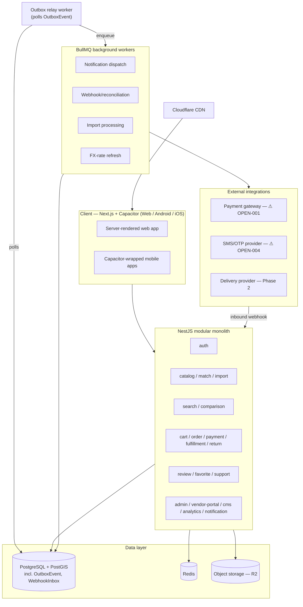

# SRS — Part 6: Architecture (Section M), Product Matching & Data-Quality Strategy (Section N), Testing & QA (Section O), DevOps & Operations (Section P)

Builds on every prior part. This is where the FYP Delivery Increment's deferred tech choices (Part 1, D.4: "framework choice finalized in Part 6") get made, and where they're justified against the constraints established from the start: a 2-person, 3-month team, a modular-monolith bias per the master prompt's explicit caution against microservices without justification, and the NFR-SEO-001 risk flagged in Part 4 about client-side-only rendering.

---

## M. Architecture recommendation

### M.1 Modular monolith vs. microservices — decision

**Recommendation: a single modular monolith**, internally organized into modules that mirror Part 2's 22 FR domains (one module per `FR-*` prefix — `auth`, `vendor`, `catalog`, `match`, `import`, `search`, `comparison`, `pricing`, `inventory`, `cart`, `order`, `payment`, `fulfillment`, `return`, `review`, `favorite`, `notification`, `support`, `admin`, `vendor-portal`, `cms`, `analytics`), each with an explicit internal interface and its own slice of the database schema (Part 3).

**Why not microservices:** the master prompt explicitly cautions against recommending microservices unless scale or organizational boundaries justify them. Neither applies here — the team is 2 people for the FYP window (no organizational boundary to draw services around), and the traffic/data volumes this platform will see well past the FYP (tens of thousands of offers, hundreds of concurrent users) are comfortably within what a well-indexed Postgres instance and a vertically-scaled application server handle without service decomposition. Microservices would add network-call failure modes, distributed-transaction complexity (directly working against BR-010's atomicity requirement), and deployment/ops overhead that a 2-person team cannot absorb.

**Why "modular," not just "monolith":** module boundaries are enforced in code (no module reaches directly into another module's database tables or internal functions — only through its public interface), which is what makes a future extraction *possible* if it's ever justified, without paying the microservices tax now. `Search` and `Notification` are the two modules most likely to be worth extracting first if that day comes (naturally stateless, different scaling profile from the transactional core) — noted as the scaling path (M.6), not a current plan.

### M.2 Technology stack, with justification and alternatives

| Layer | Recommendation | Why | Alternatives considered | Cost/ops tradeoff |
|---|---|---|---|---|
| Backend framework | **NestJS (Node.js + TypeScript)** | Structured modular-monolith support out of the box (modules/providers map directly to M.1's design); TypeScript shared with the frontend (one language for a 2-person team, fewer context switches, shared type definitions for API contracts) | Django/Python, Laravel/PHP — both fine, rejected only because they don't share a language with the recommended frontend | Free/open-source; hosting cost is the same as any Node app |
| Database | **PostgreSQL, with the PostGIS extension** | Relational integrity matches Part 3's FK-heavy data model exactly; JSON columns handle `CanonicalProductVariant.structural_attributes`'s variable shape; PostGIS gives real geo-distance queries for delivery zones and "nearby branch" search (FR-SEARCH-006, FR-FUL-004) instead of approximating with bounding boxes | MySQL (weaker JSON/geo support), MongoDB (would fight the FK-heavy relational model Part 3 deliberately chose to prevent the vendor-offer/canonical-product anti-pattern, G.1) | Free/open-source; every major host offers managed Postgres |
| Client (Web + Android + iOS) | **Next.js (React + TypeScript), server-rendered, wrapped for mobile via Capacitor** | Directly resolves the NFR-SEO-001 risk flagged in Part 4: Next.js pre-renders/server-renders public pages (home, search, product detail, comparison, store page) so they're indexable, which a comparison platform's core value proposition depends on. Capacitor packages the same web codebase into installable Android/iOS apps, satisfying Q9's "Web + Android + iOS from one build effort" without a second codebase. Same language (TypeScript) as the backend. | **Flutter** — excellent for a single 3-platform codebase, but Flutter Web is a poor fit specifically for SEO-first, document-like public catalog pages: it's not that indexing is impossible, but Flutter's own web guidance points toward serving separate, purpose-built SEO/HTML content for pages that need to rank — which is exactly the second web surface this plan is trying to avoid needing at all. Rejected for that specific reason, not on popularity grounds. **React Native** — good native feel, but still needs a separate web app (React Native Web has real gaps), so it doesn't reduce codebases the way Capacitor does once Next.js is already required for SEO. | Free/open-source; Capacitor adds a thin native-shell build step, not a second app to maintain |
| Search | **PostgreSQL full-text search (`tsvector`/`tsquery`) + `pg_trgm`** for typo tolerance, at FYP/initial-MVP scale (≤10,000 offers, per NFR-PERF-002) | Avoids standing up and operating a separate search engine before catalog size justifies it; Postgres FTS covers FR-SEARCH-001–004 adequately at this scale | **Meilisearch** — recommended **migration target**, not the initial choice: strong Arabic tokenization, far lower ops overhead than Elasticsearch. Migration trigger: catalog exceeds ~100k offers, or search p95 (NFR-PERF-002) consistently breaches target on Postgres FTS. | Postgres FTS: $0 extra; Meilisearch: a new small service to operate, deferred until the trigger above is hit |
| Cache / short-lived state | **Redis** | Session storage, rate-limiting counters (H.1), the OTP-verification idempotency-key mechanism (Part 4), FX-rate cache (⚠ OPEN-002) | Application-memory cache — rejected, doesn't survive a restart or support multiple app instances | Cheap managed Redis tier is standard on every recommended host below |
| Background jobs / queue | **BullMQ (Redis-backed), fed by a transactional outbox in Postgres (`OutboxEvent`, Part 3) rather than enqueued directly inside a database transaction** | Handles notification dispatch retries (FR-NOTIF-004), webhook processing (the durable-`WebhookInbox`-write pattern from Part 4), import processing, reconciliation jobs, FX-rate refresh. **Correction from the initial draft:** a Redis/BullMQ enqueue is not part of a PostgreSQL transaction — if it were described as happening "inside" the checkout transaction, a Redis outage at that exact moment would leave a committed order with a job that was never actually enqueued (lost vendor notification, lost payment-side follow-up). See M.4 for the corrected outbox pattern, which is what actually makes this durable. | Kafka/RabbitMQ — explicitly rejected as overkill for this team/scale; would be justified only if throughput or multi-consumer fan-out ever demanded it | No extra infrastructure beyond the Redis instance already needed for cache, plus one small Postgres table and a lightweight relay worker |
| Object storage | **S3-compatible storage (Cloudflare R2 recommended)** | Product images, review images, vendor verification photos (BR-022); R2 has no egress fees, which matters for an image-heavy comparison platform on a small budget | AWS S3 — equally valid technically, chosen against only on egress cost for a cost-conscious FYP/early-stage budget | Pay-per-use, low at FYP scale |
| CDN | **Cloudflare** | Pairs with R2; free tier covers FYP needs; incidental DDoS/rate-limiting help | — | Free tier sufficient at this stage |
| Maps / geolocation | **OpenStreetMap tiles via Leaflet** (client-side map rendering only) | Every pin in this system — customer address, vendor branch, delivery-zone boundary — is manually placed by a user dragging a pin on the map; no address-to-coordinate geocoding is performed anywhere, so only map *rendering* is needed, not a geocoding API (Part 7, DEP-009). PostGIS (above) handles the resulting distance/zone queries. | Mapbox / Google Maps Platform — richer styling, but paid and unjustified for a rendering-only need at this budget/scale | Free (OSM/Leaflet); ⚠ DEP-009 (account/provider not yet set up) |
| API gateway | **None as a separate component** — the NestJS app's own routing/middleware handles H.1's conventions (versioning, rate limiting, auth) | A dedicated gateway (Kong, AWS API Gateway) is unjustified complexity for a modular monolith; would only be reconsidered if microservices decomposition ever happened (M.1) | — | $0 |
| Notifications | **SMS/OTP: ⚠ provider pending OPEN-004**; **Email: a transactional provider (e.g., Postmark/SendGrid)** for the optional email channel | Email is low-risk/low-cost since it's optional per Q12; SMS/OTP provider selection remains explicitly open | — | Email: cheap, pay-per-send; SMS: unknown until OPEN-004 resolves |
| Analytics/reporting | **Postgres-backed reporting queries + Metabase (self-hosted, free)** at FYP/initial-MVP scale | A dedicated analytics platform (Segment/Amplitude) is unjustified cost/ops for this team size | Migration path: revisit once report volume/complexity outgrows direct SQL + Metabase | Free (self-hosted) to low-cost (managed Metabase Cloud tier) |
| Monitoring/error tracking | **Sentry** (generous free tier) for error tracking; basic uptime monitoring on the deployment host | Satisfies NFR-OBS-001/002 without heavy ops burden | — | Free tier sufficient at FYP scale |
| Deployment / CI-CD | **GitHub Actions** (ties directly to the repo already in use) running tests and deploying to a managed platform host (**Railway, Render, or Fly.io** — pick one during setup) rather than raw AWS/Kubernetes | Far less ops overhead than self-managed infrastructure for a 2-person team; still a real, production-capable path | Raw AWS/GCP/Kubernetes — explicitly deferred; a credible migration path exists once scale or cost structure demands it, not chosen now for its own sake | Managed-host tier costs are predictable and low at FYP scale |

### M.3 Logical component diagram

### M.4 Data flow, transaction boundaries, and event/webhook processing

- **Checkout (BR-010's atomicity requirement) — the transactional outbox pattern, corrected from the initial draft:** `Client → cart module (revalidate) → order module`, which creates `CustomerOrder` + `VendorSuborder`(s) + `OrderItem`(s) + `PaymentAllocation`(s) **and one or more `OutboxEvent` rows** (e.g., `SuborderNotificationsDue`, `PaymentAuthorizationRequested`) **all in one PostgreSQL transaction**. Writing the `OutboxEvent` row is a normal transactional Postgres write, so it commits or rolls back atomically with the order itself — this part is genuinely transactional. What is **not**, and must never be described as being inside that transaction, is the Redis/BullMQ enqueue: Redis is a separate system PostgreSQL cannot include in its transaction. Instead, a small, separate **outbox relay worker** continuously polls (`SELECT ... FOR UPDATE SKIP LOCKED`, or an equivalent claim mechanism) for `Pending` `OutboxEvent` rows, publishes each to the appropriate BullMQ queue, and only then marks it `Published`. If Redis is briefly unavailable at the moment of checkout, the order still commits successfully, its `OutboxEvent` rows simply stay `Pending`, and the relay worker delivers them as soon as Redis recovers — nothing is lost. Because delivery to BullMQ is consequently **at-least-once** (the relay could publish an event and crash before marking it `Published`, then retry it), every downstream job handler (notification dispatch, payment-authorization trigger) is itself idempotent — the same guarantee Part 4 already requires for the customer-facing API surface, applied here to the internal one too. This whole pattern deliberately avoids holding a database lock across a slow external call and avoids distributed-transaction/2PC complexity, consistent with keeping this a monolith.
- **Inbound webhooks (Part 4's contract):** the webhook endpoint is a thin, fast handler that does only two things synchronously — verify the signature, and durably insert the `WebhookInbox` row — then returns `200`. `WebhookInbox` itself plays the same role `OutboxEvent` plays for checkout: a durable Postgres table recording pending work, polled by a worker (rather than requiring a synchronous, non-transactional Redis enqueue at the exact moment of the HTTP request) that performs the actual `PaymentTransaction`/`PaymentTransactionAllocation` processing (Part 4, H.3) and marks the row `Processed`. This is exactly what makes the "200 only after durable receipt" contract fixed in the Part 4 review achievable: durability (a Postgres write) and processing (a worker's job, retried until it succeeds) are two separate steps, not one.
- **Search-index synchronization:** at FYP/initial-MVP scale (Postgres FTS, M.2), there is no separate index to keep in sync — `tsvector` columns update transactionally as part of the normal offer/canonical-product write. The **migration path** to Meilisearch (M.2) would introduce an outbox-table-driven async sync worker at that point — noted now so the eventual migration doesn't require redesigning the write path, only adding a consumer of writes that already happen.
- **Inventory synchronization:** manual/CSV/API writes all go through the `inventory` module directly (no separate sync process needed, since most vendors are manual-entry per Q6/ASM-005); a scheduled worker sweeps `OfferBranchInventory` to apply the staleness flagging in NFR-STALE-001/BR-005, rather than attempting real-time synchronization with vendors who have nothing to synchronize with.
- **Failure handling:** every BullMQ job uses exponential backoff with a capped retry count (Part 4, H.1), landing in a dead-letter queue visible in the admin portal (FR-ADMIN-001) on exhaustion; Sentry captures exceptions from both the API and the workers.

### M.5 Vendor data-isolation strategy

Row-level scoping via `vendor_id` on every vendor-owned table (Part 3, G.1's structural rule) is enforced at the **application query layer**: every vendor-scoped repository/query is built through a shared helper that injects the `vendor_id` filter, so an individual developer cannot accidentally write a query that leaks across vendors. This is sufficient for the FYP/initial-MVP scale. **Upgrade path (Phase 2):** Postgres Row-Level Security (RLS) policies as defense-in-depth, so isolation is enforced by the database itself even if an application-layer bug ever slipped through — not required now, but the schema (every vendor-owned table already has `vendor_id`, per the Part-3 review fix) is RLS-ready without a migration.

### M.6 Scaling path

Vertical scaling of the single application instance and the Postgres instance is sufficient through the FYP window and well into early production traffic. The first horizontal-scaling step is simply running multiple stateless API instances behind a load balancer — already enabled by the fact that session/rate-limit state already lives in Redis (M.2), not in-process. Service extraction (M.1) is deferred indefinitely, revisited only if a specific module's load profile diverges sharply from the rest **and** the team has grown enough to own a separate service — not before.

---

## N. Product matching and data-quality strategy

This section operationalizes FR-MATCH-* (Part 2) and BR-001/002/007/010 (Part 3) into a concrete scoring and workflow strategy.

### N.1 Matching signals and confidence scoring

| Signal | Used for | Weight in confidence score |
|---|---|---|
| Exact identifier (barcode/GTIN/EAN/UPC/ISBN/MPN) | Auto-link (BR-001) | N/A — bypasses scoring entirely; confidence = 1.0, auto-approved |
| Brand + model token match | Candidate ranking for the review queue | 40% |
| Normalized-title similarity (e.g., trigram/cosine similarity after locale-aware normalization) | Candidate ranking | 30% |
| Attribute-value overlap against the category's attribute template (FR-CAT-003) | Candidate ranking | 20% |
| Image-assisted similarity (perceptual hash / embedding) | **Not used at FYP/initial-MVP scale** — explicitly Phase 2+, deferred given team size/timeline | 10% reserved for Phase 2 |

**Deliberately excluded from the confidence score: price similarity.** Two honest vendors' prices for the identical real product can legitimately differ a lot — that's the platform's entire value proposition — so treating price similarity as a *matching* signal would be conceptually backwards. Price is instead used for the separate anomaly-detection duty in N.3, applied *after* a match is confirmed, never before.

### N.2 Review thresholds and the human-approval workflow

- **Confidence ≥ 0.85:** still queued for human review (Q5/BR-001 confirmed no fuzzy match is ever auto-approved), but the UI pre-selects it as "likely match" to speed up the reviewer's decision — a UI convenience, not an approval shortcut.
- **0.5 ≤ confidence < 0.85:** queued, presented as one of several candidates for the reviewer to compare side by side (Part 5, K.1's Product-match review queue screen), no pre-selection.
- **Confidence < 0.5:** not offered as a match candidate at all — the offer defaults to unmatched/standalone (FR-MATCH-009) unless a reviewer manually searches for and assigns a match.

**Cases that must never be automatically matched, regardless of score:**
- Anything without an exact identifier (the general rule, restated).
- A **used/refurbished** offer against a "new" canonical entry, purely on title similarity — condition is an offer-level property (FR-CAT-004), and a used listing's title noise must not be allowed to inflate a match score that would misrepresent condition in comparison.
- A **bundle** (`CanonicalProduct.product_type = bundle`, FR-CAT-012) against an individual-component canonical entry — bundles are their own product type by design and are never matched against a component, no matter how high the title-similarity score.

### N.3 Data-quality scoring (beyond matching)

- **Completeness score** (0–100%) per offer: required + recommended fields filled (image present, description length, every category-required attribute per FR-CAT-003) — surfaced to the vendor as a quality nudge in the offer editor (extends FR-VPORTAL-002), **never a publication gate**. Feeds FR-ANALYTICS-002's catalog-quality reporting.
- **Price-anomaly detection:** an offer priced beyond a configurable deviation from the median of other offers on the same `CanonicalProductVariant` (default: >50% below median) is flagged for reviewer attention — not blocked, just flagged. This is primarily a defense against a common real-world CSV-import bug (a missing decimal point, a currency mix-up) rather than a judgment on legitimate discounting. Feeds FR-ANALYTICS-002/FR-PRICE.
- **Inventory-freshness scoring** is already fully specified by BR-005/NFR-STALE-001 — noted here only as part of the same overall data-quality family surfaced on FR-ANALYTICS-003, not a new mechanism.

### N.4 Match-quality monitoring (feeds FR-ANALYTICS-002)

| Metric | Formula |
|---|---|
| Auto-match rate | auto-approved offers ÷ total offers submitted, in a period |
| Reviewer throughput | matches decided ÷ reviewer-hours available |
| Reviewer accuracy | 1 − (offers later reported incorrect via FR-MATCH-005 ÷ offers that reviewer approved), in a period |
| Time-to-match | median time from an offer entering the queue to a decision |

### N.5 Merge, split, and vendor correction requests

Already specified functionally in FR-MATCH-006/007 (Part 2) — Section N adds only the operational note: a merge/split is a catalog-admin action gated the same way `POST /product-matches/{id}/decision` is gated (Part 4) — never a side effect of an ordinary catalog edit — and every vendor-reported incorrect match (FR-MATCH-005) re-enters the review queue at its original confidence score plus a "reported incorrect" flag, which the match-quality metrics above track per reviewer for accountability.

---

## O. Testing and quality assurance

### O.1 Test levels and what each covers

| Level | Covers |
|---|---|
| Unit | Business-rule logic in isolation (BR-0xx implementations, state-machine transition validity per Part 2's explicit valid/invalid transition tables) |
| Integration | Module-to-module interaction within the monolith (e.g., checkout module correctly invoking inventory revalidation) and module-to-database correctness against Part 3's schema/constraints |
| API contract | Every representative endpoint in Part 4, H.3, against its documented request/response/error contract |
| End-to-end (E2E) | Full user journeys from Part 5, K.2, run against a real (staging) environment |
| Security | OWASP-class checks (injection, XSS, broken object-level authorization against Part 1's role/permission boundaries) — full threat model in the eventual Section J |
| Performance | Against the NFR-PERF-* targets (Part 4, Section I) |
| Accessibility | Against NFR-A11Y-001/NFR-RTL-001 on core flows |
| Localization/RTL | Every customer-facing screen in both Arabic and English, RTL layout mirroring per Part 5, K.1's per-screen notes |
| Payment | Every branch of the Payment state machine (Part 2, E.11), including the AwaitingPayment/PaymentFailed paths added in the Part-5 review |
| Webhook | Duplicate delivery, out-of-order delivery, signature failure, and durable-receipt-then-5xx-on-write-failure — the exact scenarios specified in Part 4, H.3 |
| Search quality | Zero-result rate, Arabic normalization/typo-tolerance correctness (FR-SEARCH-002/003) |
| Product-matching | Confidence-scoring correctness (N.1) and the never-auto-match cases (N.2) |
| Import | Partial-success handling, retry-failed-rows idempotency (FR-IMPORT-003/012) |
| Multi-vendor checkout | The full BR-009/010 partitioning and atomicity guarantees, including partial-vendor-rejection (L-13) |
| Disaster recovery | Backup-restore drill against NFR-REL-001/002 (at least once before production MVP launch, per Part 4) |
| User acceptance (UAT) | Vendor-pilot and customer-beta sign-off against the FYP Delivery Increment's exit criteria (Part 1, D.3) |

### O.2 High-priority test scenarios (seed set for Part 9's traceability matrix)

| ID | Scenario | Covers |
|---|---|---|
| TC-AUTH-001 | OTP verify with a valid, unexpired, unused code succeeds and returns a session | FR-AUTH-003, `POST /auth/otp/verify` |
| TC-AUTH-002 | Retrying `POST /auth/otp/verify` with the same `Idempotency-Key` within the short-lived window replays the original session, not a new OTP check | Part 4's OTP idempotency fix |
| TC-MATCH-001 | An offer with a matching GTIN auto-links with confidence 1.0 and never enters the review queue | FR-MATCH-002, BR-001 |
| TC-MATCH-002 | A used-condition offer with a high title-similarity score against a "new" canonical entry is never auto-matched | N.2 |
| TC-CART-001 | A cart with items from 3 vendors partitions correctly and enforces each vendor's minimum order independently | FR-CART-001/003, BR-009 |
| TC-CHECKOUT-001 | Checkout with online payment creates suborders in `AwaitingPayment`, invisible to the vendor, until Payment reaches `Authorized` | The Part-5 L-15 fix |
| TC-CHECKOUT-002 | Checkout with a failed online payment routes the affected suborder to `PaymentFailed`, never notifies the vendor, and the parent order recomputes correctly | Same fix, negative path |
| TC-CHECKOUT-003 | A duplicate checkout submission with the same `Idempotency-Key` returns the original order, never a second one | FR-CART-008 |
| TC-ORD-001 | One vendor rejecting its suborder leaves sibling suborders from other vendors unaffected and moves the parent order to `PartiallyCancelled` | FR-ORD-003, L-13 |
| TC-RET-001 | A return request on an item whose own `Fulfillment` is Delivered succeeds even while a sibling item's separate `Fulfillment` (split shipment) is still in transit | BR-025 |
| TC-RET-002 | A return request on an item whose parent suborder was `RejectedByVendor`/`Cancelled` is rejected with `ITEM_NOT_YET_DELIVERED` | BR-025's invalid-transition rule |
| TC-PAY-001 | A duplicate payment-gateway webhook (same `provider`+`event_id`) is acknowledged `200` without reprocessing | `WebhookInbox` uniqueness, Part 4 |
| TC-PAY-002 | A webhook whose durable `WebhookInbox` write fails returns `5xx`, not `200` | The Part-4 webhook-durability fix |
| TC-PAY-003 | A webhook referencing an unknown `gateway_ref` lands `Reconciling`, not rejected or dropped | Part 4, H.3 |
| TC-PAY-004 | A partial refund creates a `Refund` scoped to the specific `PaymentAllocation`, not the whole order | BR-013, Part 3 |
| TC-PAY-005 | A webhook request with an invalid/forged signature is rejected before any `WebhookInbox` row is written — no durable record of an unverified event | Part 4, H.1/H.3 signature-first ordering |
| TC-PAY-006 | A single gateway transaction that covers multiple vendors (blended charge) correctly fans out across multiple `PaymentAllocation` records via `PaymentTransactionAllocation`, **and** the alternative — one gateway transaction per vendor/currency (per-suborder charge) — reconciles just as correctly; both resolutions of ⚠ OPEN-007 must reconcile without a schema change | Part 3's `PaymentTransactionAllocation`, ⚠ OPEN-007 |
| TC-OUTBOX-001 | Transactional-outbox recovery: the checkout transaction commits successfully (order + `OutboxEvent` rows persisted) but the relay worker's publish to BullMQ fails on the first attempt (simulated Redis outage) — the worker later delivers the pending `OutboxEvent` and the downstream job's effect (e.g., BR-DELIVERY-CONFIRM notification) happens exactly once, never zero or duplicated in a customer-visible way | Part 6, M.4's outbox pattern; Part 3's `OutboxEvent` |
| TC-SEC-001 | Tenant isolation / broken object-level authorization: Vendor A's authenticated session cannot read or mutate Vendor B's data by substituting Vendor B's ID into any request (branch, offer, order, subscription, staff endpoints) — every such attempt returns `403`/`404`, never the data | Part 1, Section C's vendor data-visibility boundary; M.5's vendor-isolation strategy (this part) |
| TC-MATCHAPI-001 | A repeated, byte-for-byte identical decision on an already-decided `ProductMatch` returns the existing state with `200`; a *different* decision on the same match returns `409` | Part 4's match-decision idempotency fix |
| TC-IMPORT-001 | A CSV import with 3 invalid rows commits the valid rows and reports the 3 failures individually | FR-IMPORT-003 |
| TC-IMPORT-002 | Retrying a failed import job reprocesses only the previously failed rows, not the already-committed ones | FR-IMPORT-012 |
| TC-PRICE-001 | Saving a price change on an offer — whether via the manual editor (`BL-IMPORT-001`) or a bulk CSV import row (`BL-IMPORT-002`) — writes a `PriceHistory` row (new price, currency, timestamp) in the same transaction as the save; a save that doesn't change the price writes no new row | FR-PRICE-002 |
| TC-SEARCH-001 | A search query with a common Arabic spelling variant returns the same results as the canonical spelling | FR-SEARCH-002 |
| TC-COMP-001 | Comparing two offers in different currencies shows both the native and FX-normalized price with the rate/date disclosed | FR-COMP-009, ⚠ OPEN-002 |
| TC-INV-001 | **Concurrent** test: an offer with exactly one unit in stock is in two different customers' carts; both submit checkout simultaneously. The atomic conditional decrement (FR-INV-004) must let exactly one succeed and the other fail with the item blocked on that line only, rest of cart preserved — never both succeeding (oversold) and never both failing (a false-negative lock conflict) | FR-INV-004, FR-CART-016 |
| TC-VEND-001 | A vendor branch marked physical cannot be approved without both a geolocation pin and a storefront photo | BR-022 |
| TC-VEND-002 | A suspended vendor retains access to its Orders queue/Order detail/Returns queue but loses new-offer/storefront visibility | Part 5, L-23 fix |
| TC-SUB-001 | A vendor subscription reaching its grace-period deadline without payment transitions to Suspended, not immediately on the due date | BR-014, ⚠ OPEN-003 |
| TC-A11Y-001 | Every status/severity indicator across the admin and vendor portals is distinguishable without relying on color alone | Part 5, K.1 accessibility notes |
| TC-RTL-001 | The full customer checkout flow mirrors correctly in Arabic, including form field order and the comparison table's sticky column | NFR-RTL-001 |
| TC-DR-001 | A full-environment restore from the most recent backup meets the NFR-REL-001/002 RPO/RTO targets | Part 4, I.2 |
| TC-ILS-001 | Every create/import/price/discount/checkout/refund path rejects non-ILS money and no response exposes an FX-normalized or native-currency amount. | PDR-001, FR-PRICE-008, BR-027 |
| TC-ROLE-001 | A customer account that is also a branch employee can switch workspaces, but its employee workspace can read/mutate only its one active branch; price, media, description, analytics and cross-branch attempts are denied. | PDR-008/009, FR-VEND-013, FR-VPORTAL-007 |
| TC-ROLE-002 | Disabling an employee invalidates active work access immediately while their historic inventory/order actions remain in the audit trail. | PDR-008/009 |
| TC-STOCK-001 | Two concurrent physical sales against the final unit allow exactly one atomic decrement and leave an immutable inventory movement/audit record. | PDR-020, FR-INV-009 |
| TC-STOCK-002 | Damage/loss/count correction without reason is rejected; any valid manual reduction sends an owner alert regardless of quantity. | PDR-021, FR-INV-010, BR-031 |
| TC-CHECKOUT-004 | Selected cart lines that one branch can fulfil are one BranchOrder; lines without a shared eligible branch become separate BranchOrders. Unselected cart lines remain untouched. | PDR-003/004, FR-CART-017, FR-ORD-009 |
| TC-CHECKOUT-005 | Checkout proposes nearest eligible branch but accepts a customer-selected farther eligible branch; it rejects a branch missing any selected variant. | PDR-023, FR-CART-018, BR-029 |
| TC-FUL-001 | A delayed preparation produces the six-hour employee reminder; at slot time online payment offers reschedule/refund and COD expires after 48 hours without a new slot. | PDR-025 |
| TC-FUL-002 | At Delivered, customer confirmation is requested; no response is reminded at 48 hours and auto-confirms at 72. A report may reset to Sent only through the staff action and creates fresh confirmation. | PDR-026, BR-034 |
| TC-ONLINE-001 | Online-only store pickup points are public/selectable but have no inventory rows; checkout reserves warehouse stock and never exposes warehouse address. | PDR-010, FR-VEND-012 |
| TC-RETURN-003 | A store return-policy change is blocked inside six months and an order evaluates the policy/fees snapshotted at its purchase, not today’s policy. | PDR-030, FR-RET-008, BR-033 |
| TC-DISC-001 | A public product card chooses lowest eligible ILS price and up to five cheapest store logos, excluding unavailable/inactive offers; logo navigation opens the exact store offer. | PDR-015/016, FR-COMP-010/011 |

Full requirement-to-test traceability is completed in Part 9.

---

## P. DevOps and operations

| Area | Approach |
|---|---|
| **Environments** | Development (local), Staging (mirrors production config, used for E2E/UAT per O.1), Production. All three share the same NestJS/Next.js codebase and Postgres schema, differing only in configuration and data. |
| **CI/CD** | GitHub Actions: on every pull request, run unit + integration + API-contract tests (O.1); on merge to `main`, deploy to Staging automatically; Production deploys are a manual-approval gate in the same pipeline, never automatic, given the FYP team's size and the cost of an unreviewed production mistake. |
| **Database migrations** | Versioned migration files (e.g., via the ORM's migration tool) applied as part of the deploy pipeline, always additive-first (new columns nullable/defaulted before any code depends on them) to avoid a deploy-order dependency between schema and application code. |
| **Feature flags** | FR-ADMIN-004's admin-configurable flags gate Phase-2+ capabilities; also used operationally to stage a risky change behind a flag before full rollout. |
| **Secrets** | Managed via the deployment host's secret-store (never committed to the repo); payment-gateway and SMS-provider credentials (⚠ OPEN-001/OPEN-004) are placeholder-only until those integrations are selected. |
| **Monitoring, logging, metrics, tracing** | Sentry for error tracking (M.2); structured logs carrying `X-Correlation-Id` (Part 4, H.1) so a single request is traceable end-to-end across the API and any BullMQ jobs it triggered; the admin portal's integration-monitoring dashboard (FR-ADMIN-006) is the primary metrics surface at this scale — a dedicated tracing system (e.g., OpenTelemetry backend) is a Phase-2 addition once the modular monolith's request flows are complex enough to need it. |
| **Alerting** | Sentry alerts on error-rate spikes; a scheduled job checks the dead-letter queue (M.4) and BullMQ backlog depth, alerting if either grows past a threshold. |
| **Backups** | Hourly automated Postgres backups (NFR-BACKUP-001), verified restorable on a regular schedule, not just taken and assumed good. |
| **Disaster recovery** | A documented runbook, exercised at least once before production MVP launch (NFR-DR-001) — not required for the FYP demo environment, which has no formal SLA. |
| **Scheduled jobs** | BullMQ recurring jobs: inventory-staleness sweep (BR-005), price-staleness sweep (BR-004), FX-rate refresh (⚠ OPEN-002), subscription grace-period checks (BR-014, ⚠ OPEN-003), `WebhookInbox` reconciliation retry (Part 4). |
| **Search reindexing** | Not applicable at FYP/initial-MVP scale (Postgres FTS updates transactionally, M.4); becomes a real operational task only after the Meilisearch migration trigger (M.2) is hit — a reindex job is part of that migration's own scope, not built ahead of need. |
| **Failed-job handling** | BullMQ's dead-letter queue, visible in the admin portal (FR-ADMIN-001), with manual replay capability for a support/ops actor. |
| **Webhook replay** | A `WebhookInbox` row stuck `Reconciling` past a threshold is surfaced in the admin portal's Payments & settlements screen (Part 5, K.1) for manual investigation and, if needed, manual replay of the reconciliation job. |
| **Support runbooks** | Short, versioned runbooks for the highest-risk operational scenarios: payment-webhook backlog, import stuck mid-batch, vendor-verification queue backlog past SLA. |
| **Incident management** | Sentry issue + a brief incident note in the admin portal's audit/ops view; severity levels tied to which NFR-AVAIL/NFR-REL target is at risk. |
| **Release rollback** | The deploy pipeline keeps the previous release deployable via a one-click redeploy on the hosting platform (Railway/Render/Fly.io all support this natively); database migrations are written to be backward-compatible for at least one release, so a rollback never leaves the schema ahead of the code. |
| **Data correction procedures** | Any manual data correction (e.g., fixing a stuck order) goes through an admin-portal action that writes an `AuditLog` entry (BR-019) — never a direct database edit outside the audit trail, even for the small FYP team. |
| **Administrative break-glass access** | A platform-super-admin-only override path, always reason-captured and audit-logged (BR-019, Part 1 Section C) — used sparingly, and every use is visible in the audit log (FR-ADMIN-005). |

---

**Next:** Part 7 will cover Section Q (risks and decisions — risk/assumption/dependency/open-question registers, ADRs, and BDRs), consolidating the ⚠ OPEN-001–007 items and every provisional default flagged across Parts 1–6 into formal registers.
